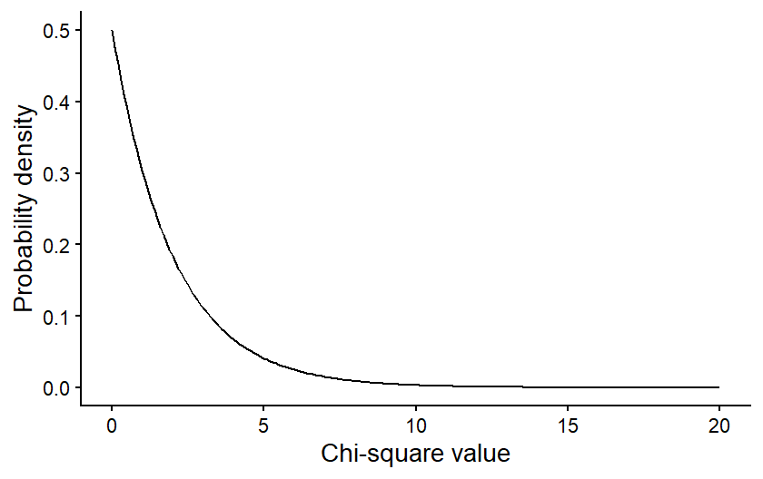

```{r setup, include=FALSE}
knitr::opts_chunk$set(echo = TRUE)
```

# Lesson 10: Categorical Data
In our first foray into statistical testing, we will focus on Chi-square analyses. Like when we decide on a type of graph to make, the types of variables we are working with in our analysis help us determine the type of statistical test to use. Chi-square analysis are used when we have a categorical independent variable and count data (discrete) as the dependent variable. In this lesson, we will start with a conceptual overview of Chi-square tests and then learn how to run the tests in R.

## 10.1 Conceptural overview of Chi-square tests
Chi-square tests are used to compare the frequencies of observations in different categories to expected frequencies for those categories. There are two common versions of this test: the goodness of fit test and the test of independence (contingency table test). The goodness of fit test is used when you have a single categorical variable and you want to compare the proportion of observations in each category to an expected proportion. The test of independence is used when you have two categorical variables and you want to test whether the frequency of observations in the categories of one variable depend on the other variable. Both tests are described in more detail below. The overall approach is similar for both, though, and is the same general approach as we discussed in our lesson on hypothesis testing. You start by identifying expected values based on a null hypothesis, calculate deviations between your expected and observed frequencies, and calculate the probability of deviation greater than or equal to those you observed, assuming the null hypothesis is true.

### Goodness of fit test
The Chi-square goodness of fit test compares observed frequencies of categories for a single variable to expected observations for those categories. Some examples of questions that can be answered with a goodness of fit test are:

1. Does the frequency of parasite infection vary between two species of antelope?
2. Do the genotype frequencies in a population of fish differ from the expectations of the Hardy-Weinberg equilibrium model?
3. Does the frequency of traits in offspring differ from the prediction of Mendelian inheritance?

#### Null and alternative hypotheses
The null hypothesis for a Chi-square goodness of fit test is that the frequency of observations in equal to the expected frequency, and the alternative hypothesis is that they are not equal. The expected frequency depends on our question. Oftentimes, we simply want to ask if the frequency of observations is equal amongst our categories. In that case, our null hypothesis would be that the frequencies, or proportions, are equal. However, in other cases, we might have a different expectation. Genetics is a good example of this. In studies of inheritance, we are often interesting in determining if a trait follows Mendelian inheritance patterns. In this case, our null hypothesis would be based on the expectations of Mendelian inheritance. For example, if we crossed two heterozygous parents, we would expect 3/4 of the offspring to have the dominant trait and 1/4 of offspring to have the recessive trait. These would then be the expected frequencies for our null hypothesis. 

### Test of independence
The Chi-square test of independence, also known as a contingency table test, is used when you have two categorical variables, and you want to test if the frequency of observations in one variable is influenced by the other variable. Some examples of questions that can be answered with a test of independence are:

1. Does the frequency of bee visits to different flower colors depends on the species of bee?
2. Does the frequency of malaria infection depend on an individual's genotype?
3. Does the habitat type affect the frequency of the presence/absence of an endangered plant?

#### Null and alternative hypotheses
Like in a goodness of fit test, in a test of independence, the null hypothesis is that the frequency of observations in equal to the expected frequency, and the alternative hypothesis is that they are not equal. What differs is how we determine the expected frequencies. In a goodness of fit test, we have some pre-determined expectation of frequencies for our null hypothesis. In a test of independence, we are interested in the relationship between our variables, and the expected frequencies are based on the values of the observations in our data set. Let's look at one of our example questions from above to see how we would determine the expected values.

Image you are trying to test whether different bee species have different preferences for flower colors. Here you have two different categorical variables: species and flower color. You want to test if the frequency of bee visits to different flower colors depends on the species of bee. The data you collect might look something like this:

|          | Yellow | Purple | Total |
| :--      | :---:  | :---:  | :---: |
|Species 1 |   10   |   25   |   35  |
|Species 2 |   30   |   20   |   50  |
|Total     |   40   |   45   |   85  |

These are the observed values. To determine our null hypothesis, we need to calculate the expected frequencies for each pair of categories. In order to do this, we can use the rule of multiplication that we learned about when we covered probability. The logic here is that if the preferred flower color is independent of the bee species, the probability that a bee from species 1 visits a yellow flower should be equal to the total probability that a bee belongs to species 1 multiplied by the total probability of a visit to a yellow flower (recall that the multiplication rule only works like this for independent events - when the outcome of one event does not affect the probability of the other). In this example we observed that 35 of the 85 bees were from species 1 and that 40 of the 85 visits were to yellow flowers, so the probability of a bee of species one visiting a yellow flower is $\frac{35}{85} \times \frac{40}{85} = 0.194$. We can then calculate the expected frequency by multiplying this probability by the totat number of observed individuals: $0.194 \times 85 = 16.5$. We can then use this same procedure to calculate the expected values for the remaining categories:

|          | Yellow | Purple | Total |
| :--      | :---:  | :---:  | :---: |
|Species 1 |$\frac{35}{85} \times \frac{40}{85} \times 85 = 16.5$|$\frac{35}{85} \times \frac{45}{85} \times 85 = 18.5$|   35  |
|Species 2 |$\frac{50}{85} \times \frac{40}{85} \times 85 = 23.5$|$\frac{50}{85} \times \frac{45}{85} \times 85 = 26.5$|   50  |
|Total     |   40   |   45   |   85  |

These values provide us with the expectation for our null hypothesis, and our alternative hypothesis would be that the observed frequencies do not match these expectations.

### The Chi-square test statistic
After identifying the expected frequencies and hypothesis, the process for hypothesis testing is similar for the goodness of fit test and the test of independence. Unlike in the previous hypothesis testing we practiced, when we run a Chi-square test, we don't directly calculate the probability of our observed values. Instead we calculate a test statistic that summarized the magnitude of the difference between our observed an expected values. This test statistic is called the Chi-square statistic. The larger the Chi-square value, the greater the difference between the observed values and the expected values based on the null hypothesis. We then calculate the probability of getting a Chi-square value as large or larger than our Chi-square value, assuming the null hypothesis is true.

To calculate the Chi-square value for either a goodness of fit test or a test of independence, you first calculate the difference between the observed and expected values for each category.Then you square those values, which will make all of the deviations positive, provided a measure of the magnitude of the differences, regardless of the direction of the differences for each category. Finally, you divide the squared deviations by the expected value for each category and sum the results. Here is the full equation:

$$
\sum{\frac{(O-E)^2}{E}},
$$
where $O$ is the observed value and $E$ is the expected value. In this class, you will mostly be using R to do this calculation, but it is important to keep in mind that the Chi-square statistic is a measure of the overall difference between observed and expected values in the data set.

### The Chi-square distribution
Once we have a Chi-square value, we can use it to calculate the p-value: the probability of a Chi-square value as large or larger than ours (in other words, a difference between the observed and expected values as large or larger than what we observed), assuming the null hypothesis is true. We do this using a probability distribution that gives us the probability of a certain Chi-square value, based on the null hypothesis. This probability distribution is the Chi-square distribution. 

The figure below is an example of a Chi-square distribution. The shape is intuitive, based on what we would expect from our null hypothesis. If the null hypothesis is true, that mean our observed values should be a close match for the expected values, and it is therefore more probable that the Chi-square value is low. It is less probable that you will get a large Chi-square value if the null hypothesis is true.

{width=60%}

The specific shape of the Chi-square distribution depends on a parameter known as the degrees of freedom. The degrees of freedom are a measure of the amount of independent information in your data. In many contexts, it is related to the sample size of your data. In Chi-square tests it is related to the number of categories in your data. 

For illustration, let's first consider a goodness of fit test, where you are comparing the frequencies between two categories. You have some total number of observations, say 100, and those 100 observations will be split between your two categories. Given the constraint of 100 total observations, the number of observations in the first category could be any value from 0 to 100. But once the number of observations in the first category has been set, there is only one possible value for the number of observations in your second category that will lead to a total of 100. For example, if there were 40 observations in the first category, there would have to be 60 in the second. This means only one of the values in the data set is "free to vary" and the degrees of freedom for these data are 1. If you had three categories instead of just two, then the values for two of those categories could vary, and third could not, so the degrees of freedom would be 2. In general, for a goodness of fit test, the degrees of freedom is equal to the number of categories minus 1.

For a test of independence, in addition to calculating the total number of observations, we calculate the totals for each individual category. In our bee and flower table above, for example, we calculated the total number of observations of species 1 and the total number of observations on yellow flowers. This puts further constraints on the freedom of our data, so even though there are four distinct combinations of categories in that example, the degrees of freedom is only one. If we set the value for just one category, we would be able to definitely calculate the values for the other categories, based on that one value along with the totals in the table. The general formula for degrees of freedom in a test of independence is $(r-1)(c-1)$, where $r$ and $c$ refer to the number of categories in the rows and columns of our table, respectively.

The degrees of freedom in our data affects the shape of the Chi-square distribution we would use to draw conclusions about our data. The figure below shows how the shape of a Chi-square distribution varies for four different values of degrees of freedom.

{width=60%}
The effect of the degrees of freedom on the shape of the distribution is again intuitive. The degrees of freedom will increase with the number of categories in our data set. When we calculate the Chi-square value, we sum up the deviations between the observed and expected values across all of our categories, so if we have more categories, we would expect the Chi-square value to be larger. It therefore makes sense that, even if the null hypothesis is true, there is still a higher probability of a larger Chi-square value, even if our null hypothesis is true.

### Drawing conclusions
Once we have calculated our Chi-square value and identified the degrees of freedom in our data set, we can use the correct Chi-square distribution to draw the final conclusion about our data. Again, we want to use the distribution to calculate the probability of a Chi-square value greater than or equal to ours, assuming the null hypothesis is true. This will be our p-value.

That values can be calculated from the Chi-square distribution by calculating the area under the curve of the distribution for values greater than or equal to your Chi-square value. The graph below shows an example of what that would look like for a Chi-square value of 3 from a data set with 2 degrees of freedom. The purple shading represents the probability of a Chi-square value greater than or equal to 3. 

{width=60%}
The value of the area shown (the p-value) is 0.2231, meaning that there is an approximately 22% chance of getting a Chi-square value of 3 or greater, assuming the null hypothesis is true. We interpret this the same way we interpreted the p-values in our hypothesis testing examples. If the p-value is <0.05, we reject the null hypothesis. In this case, we would not reject the null hypothesis.

Moving forward, we will be using R to run Chi-square tests. You will not be expected to be doing all of these calculations by hand. However, understanding the conceptual underpinning of the tests is important for correctly implementing and interpreting the test results.

## 10.2 Chi-square tests in R 
For this lesson, we will be working with data collected by Dr. Alan Garfinkel, who was researching methods for predicting the risk of heart attacks in older patients. Younger patients are often tested for heart attack risk by first exercising and then having their heart stress measured with an ECG. However, older patients are often unable to tolerate the exercise required for the test. Dr. Garfinkel was testing whether a medication called dobutamine, which mildly stresses the heart, can be used as an alternative. He gave patients a heart stress test after they took dobutamine, and then he followed the patients for a year to see if they had a heart attack within that time frame. This allowed him to test whether a positive result on the dobutamine stress test was a good predictor of heart attack risk.

### Goodness of fit
For our first test, we will run what is called a goodness of fit test. We can use this type of test to determine if the observed frequency of samples in different categories follow some expected frequency (the expected frequencies are the null hypothesis). In this example, we will work with the cardiac data and test whether male and female patients were equally represented in the study. In other words, was there a 50:50 ratio of male and female patients.

First, load the data set. Be sure your working directory is set to the location of the cardiac data file.

```{r cardiac_data}
cardiac <- read.csv("cardiac.csv")
```

Now, make a simple bar graph showing the frequency of male and female patients in the sample.

```{r gender_bar}
library(ggplot2)
ggplot(cardiac, aes(x=gender)) +
  geom_bar() +
  labs(x="Gender", y="Frequency") +
  theme_classic()
```

Before we can run our Chi-square test to determine if males and females were equally represented, we have to summarize our data. The Chi-square test function in R requires a simple table with the count of samples in each category (the number of male and female patients, in this example). We can create this table easily in R using the `table` function. The argument for this function is the variable we want to summarize, in this case, the "gender" variable from our cardiac data frame. Sometimes it can also be helpful to see the proportions instead of the counts. We can convert our table into proportions using the `prop.table` function.

```{r gender_prop}
gender_table <- table(cardiac$gender)
gender_prop <- prop.table(gender_table)
```

Now that we have our table with the counts of the two genders, we are ready to run our test. We will use the `chisq.test` function. The first arguments is the table with the counts, that we just created. The second argument is a vector with the expected proportion for each category. Because we are testing whether the genders are equally-represented, our expected frequencies (i.e., our null hypothesis) are 0.5 and 0.5.

```{r gender_chi}
gender_test <- chisq.test(gender_table, p=c(0.5,0.5))
gender_test
```

Based on the output, were male and female patients equally represented in the study?

If they are not equally represented, it is also important to determine which category is over-represented and which is under-represented. It is pretty easy in this case because we only have two categories, and we were testing if they had equal proportions. In other cases, the math might not be quite as simple, but we can get R to help us out. We can look at some additional output from the test to see the observed and expected values for each category as follows.

```{r gender_exp}
gender_test$observed
gender_test$expected
```

Which gender was over-represented, and which gender was under-represented?

### Test of independence
For the next test, we will work with a different type of question. Instead of just comparing the frequency in different categories of one variable, we will work with two sets of categories and test whether the frequencies of one categorical variable are affected by the other categorical variable. In this case, we will use the same cardiac data set to test whether patients who tested positive for heart stress on an ECG after receiving dobutamine were more likely to have a myocardial infarction (heart attack) within the next year than patients who tested negative for heart stress.

We'll again begin by making a bar graph. This time, because we are looking at the frequencies in two different categories, we will make a stacked bar graph. We will use the ECG results as our x variable, and each bar the ECG result categories with have two colors, showing the proportion of patients in each of those categories that did or did not have a heart attack.

```{r myo_bar}
ggplot(cardiac, aes(x=posECG,fill=newMI)) +
  geom_bar() +
  labs(x="ECG results", y="Frequency") +
  scale_fill_manual(values=c("#ce9642","#3b7c70")) +
  theme_classic()
```

Just like with the goodness of fit test, to run a Chi-square test on a contingency table, we have to convert our data to a table showing the frequency of individuals in each of the categories. In this case, our table will have two columns (positive and negative ECG tests) and two rows(heart attack or no heart attack). We will once again make two table: one showing the counts and the other showing the proportions in each category.

```{r myo_prop}
myo_table <- table(cardiac$newMI,cardiac$posECG)
myo_prop <- prop.table(myo_table)
```

Now that we have our table with the counts, we can run our Chi-square test to see if patients who tested positive for heart stress were more likely to have a heart attack within the next year than patients who tested negative for heart stress. This time, we do not have to provide the expected frequencies because we are testing whether the frequency of heart attacks differs between the two test results, NOT if the frequency matches some specific expected frequency.

```{r myo_chi}
myo_test <- chisq.test(myo_table)
myo_test
```

Notice when you run this test, you get a warning saying that the "Chi-square approximation may be incorrect". This is because you have a low sample size in one of your groups, so your count data might not be roughly normal. We can deal with this easily by adding an argument to our test. This argument will tell R to use simulations to estimate the p-value, which can be a better approach when you have low expected values for some groups.

```{r simulate}
myo_test <- chisq.test(myo_table, simulate.p.value = TRUE)
myo_test
```

Based on the test result, what do you conclude about whether the dobutamine stress test was a good predictor of heart attack risk?

To help interpret the data (e.g., see which observed values might be higher or lower than expected), we can again look at the observed and expected frequencies in each category. 

```{r myo_exp}
myo_test$observed
myo_test$expected
```

In this case, as expected from our p-value, the observed and expected frequencies match very closely.