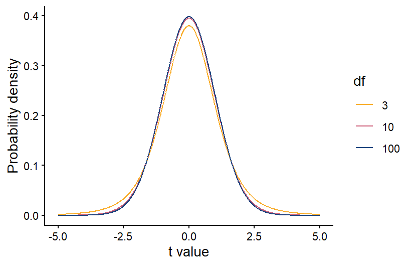

```{r setup, include=FALSE}
knitr::opts_chunk$set(echo = TRUE)
```

# Lesson 11: T-tests
In this lesson, we will move on to a new statistical test: the t-test. T-tests are part of a broader class of models known as general linear models. We can use general linear models to analyze data when we have a continuous dependent variable that is normally distributed (or at least close to normally distributed). General linear models tests will then test whether the independent variable included in the model affects the mean of the normally-distributed dependent variable. The thing that distinguishing different types of general linear models (t-tests, ANOVAs, linear regressions) is the independent variable(s). 

In this lesson, we will work through three types of t-tests: one-sample, two-sample, and paired.

## 11.1 Conceptual overview of t-tests

### One-sample t-test
A one-sample t-test is used when you want to compare the mean of your sample data to a known or expected population mean. For example, say you know that the average historical population growth rate in a population of lizards is 1.05, and you want to test whether the population growth rate from the last 10 years differs from that population average.

The overall process for running a one-sample t-test in the classic frequentist framework is similar to that used for a Chi-square test: you start identifying your hypothesis, then you use your data to calculate a test statistic, and finally you use a probability distribution to calculate the probability of a test statistical equal than or greater than yours, assuming the null hypothesis is true.

#### Hypotheses
As with our other tests, the null hypothesis is the hypothesis of no effect. In the context of a one-sample t-test, our null and alternative hypotheses would therefore be:

+ Null: The sample mean equals the known/expected mean.

+ Alternative: The sample mean does not equal the known/expected mean.

#### The t-statistic for one-sample tests
The test statistic that we calculate for t-tests is called the t-statistic. It incorporates three main pieces of information, which should be familiar to you because earlier this semester, you identified them as being important for determining statistical significance.

1. The signal (the difference between the known mean and the sample mean)
2. The noise (the variation in the data)
3. The sample size

The equation for the t-statistic for a one-sample t-test is below. You won't be required to do this calculation by hand, but we will work through how it incorporates the pieces of information above.

$$
t = \frac{\bar{x} - \mu}{s/\sqrt{n}}
$$

In the numerator, $\bar{x}$ is the sample mean and $\mu$ is the known/expected population mean. Therefore, the number represents the signal: the magnitude of the difference between the sample mean and the population mean. The greater the difference, the higher the t-statistic will be. In the denominator, the $s$ is the standard deviation, so this is our measure of the noise. The greater the standard deviation, the lower the t-statistic will be. The $n$ in the denominator is the sample size. The higher the sample size, the higher the t-statistic. This matches our expectations about how the signal, noise, and sample size affect the likelihood of a statistically-significant result. If you have a larger signal and sample size, and lower noise, you will be more likely to get a statistically-significant result, and that corresponds to a higher t-statistic.

#### Calculating the p-value
Like with the Chi-square test, once we have our test statistic we can use a probability distribution to calculate the probability of a t-statistic greater than or equal to ours. If our data are normally distributed and our null hypothesis is true, we would expect the probability of different values of the t-statistic to follow a t distribution, which is shown below. The t-distribution is similar to a normal distribution, and it is centered at zero, because if the null hypothesis is true, there should be a higher probability that the sample mean is close to the population mean. If the sample mean and population mean are equal, the t-statistic will be equal to zero.

{width=60%}

Also like with the Chi-square distribution, the specific shape of the t-distribution depends on the degrees of freedom in our data. For a one-sample t-test, the degrees of freedom is equal to the sample size minus 1. The higher the degrees of freedom, the more narrow the t-distribution. This makes sense because if we have a larger sample size, our sample mean should be more accurate. If our sample population truly has the same mean as the known/expected population mean, then a larger sample size will make it more likely that the sample mean is close to the population mean, and the t-statistic is more likely to be close to zero.

Once we have calculated the degrees of freedom, we can use the correct version of the t distribution to calculate the p-value. As always, if the p-value is < 0.05, we reject our null hypothesis.

### Two-sample t-test
A two-sample t-test is used when you have a categorical independent variable with only two values, and you want to compare the means of your two categories. For example, if you want to test whether the photosynthesis rate differs between under-story and over-story plants, this can be done with a two-sample t-test. If your categorical variable has more than two possible values, you cannot use a two-sample t-test. Instead you would use an ANOVA, which will be the next type of test we cover.

The process for running a two-sample t-test is similar to a one-sample t-test, but there are slight differences in how we state our hypotheses and calculate the t-statistic and degrees of freedom.

#### Hypotheses
In the context of a two-sample t-test, our null and alternative hypotheses are:

+ Null: The means of the two groups are equal.

+ Alternative: The means of the two groups are not equal.

#### The t-statistic for two-sample tests
For two-sample t-test, we also calculate a t-statistic, but the calculation is slightly different because we now have two sample groups instead of one sample group and one known mean. However, it still contains measures of the signal, noise, and sample size.

$$
t = \frac{\bar{x}_1 - \bar{x}_2}{\sqrt{S_p^2(\frac{1}{n_1}-\frac{1}{n_2})}}
$$

In the numerator, we now have our two sample means, $\bar{x}_1$ and $\bar{x}_2$. Therefore, the numerator still represents the signal, but this time it is the difference between the two sample means. In the denominator, $S_p^2$ is the pooled variance, which is essentially a weighted average of the variances of each sample group, with the weight determined by the sample size in each group (if they have equal sample sizes, they will be weighted equally). This is our new measure of the noise. Finally, we have the sample sizes of our two groups, $n_1$ and $n_2$. As before, if you have a larger signal and sample size, and lower noise, you will be more likely to get a statistically-significant result, and that corresponds to a higher t-statistic.

Once you have the t-statistic for a two-sample t-test, the process is the same for calculating the p-value and drawing your conclusions. Because you have two groups, though, when you calculate the degrees of freedom for the t-distribution, it is equal to $n-2$, rather than $n-1$.

### Paired t-tests
Back when we discussed experimental design, we discussed blocked designs, which are a way of accounting for variation in our data caused by variables that we are not including in our analysis. They work by applying every treatment within a block, which could be the same individual, the same plot, etc. When you analyze the data, you then make comparisons between each treatment within each block. For example, if you are testing a new drug for blood pressure, you could measure the blood pressure of each patient before and after taking the drug, and see how the drug changes the blood pressure in each patient. This will account for any differences in the baseline blood pressure of the patients. When you have a blocked design with only two treatments, known as a paired design, you can analyze the data using a paired t-test.

The null and alternative hypothesis can be phrased in the same way as they are for a two-sample t-test:

+ Null: the two groups have equal means

+ Alternative: The two groups have different means

However, because the focus of a paried t-test is on the difference between the two treatment, you can also phrase your hypotheses in terms of that difference:

+ Null: The average difference between the groups is 0

+ Alternative: The average difference between the groups is not zero

A paired t-test has similarities with both a one-sample and two-sample t-test. It is similar to a two-sample t-test in that there are two treatment groups, but the way it is run is more like a one-sample t-test.

The first step in running a paired t-test is to calculate the differences between the treatments for each pair of samples in your study. In the example of the blood pressure drug above, that would mean calculating the difference in blood pressure for each patient before and after taking the drug. At that point, the test is run just like a one-sample t-test, but you run the test using the differences between the treatments for each each pair, rather than on the raw data for the two treatments. The "known" population mean for your null hypothesis would be zero because if the two treatments have equal mean, you would expect the average difference between each pair to be zero.

Calculating the degrees of freedom for a two-sample t-test is also similar to calculating the degrees of freedom for a one-sample t-test, but keep in mind that you are running the t-test on the difference between the treatment for each pair. Therefore, your degrees of freedom is $n-1$, where $n$ is the number of pairs, rather than the total number of data points.

### Exercises

<!---LEARNR EXERCISES 1-->
   
<iframe style="margin:0 auto; min-width: 100%;" id="myIframeL3" class="interactive" src="https://rby8g8-emily-schultz.shinyapps.io/RHandbookL11/
" scrolling="no" frameborder="no"></iframe>
   
<!---------------->

## 11.2 Running the tests in R
For this section, you will be working with three related data sets, all from the Konza Prairie Long-Term Ecological Research site. The data sets all have data related to the effects of burn frequency on prairie plant communities. You will be using the three data sets to practice each of the three types of t-tests covered in section 11.1.

### One-sample t-test
An interesting thing about prairie and woodland ecosystems is that there is overlap in the climate conditions that can support these two systems. In many areas, it is fire frequency that determine which is found in an area. More frequent fires lead to prairies while less frequent fires lead to woodlands. Once one of these systems establishes, they tend to be self-reinforcing because prairies build up quick fuel that can burn more frequently, while woodlands burn less frequency. One concern about fire suppression in prairie ecosystems like the Konza Prairie is that less frequent fires can lead to woody plant encroachment. Once woody plant cover gets high enough, it can reach a tipping point, where the system shifts from a prairie ecosystem to a self-reinforcing woodland system. Previous research has shown that this tipping point happens at 5-10% woody plant cover. 

For your one-sample t-test example, you will use data on woody plant cover from unburned plots in the Konza Prairie to test whether these plot have reached the tipping point that will cause them to transition to a woodland. You will use the lower threshold of 5% cover as the "expected" population mean for your one-sample t-test. 

The date file you will use for this test is the `BurnFull.csv` file. Download it from Canvas now if you haven't already. Once you have downloaded the file, set your working directory and load the data set into R, calling it `wood`.

```{r load-one}
wood <- read.csv("Unburned.csv")
```

We will be using the `WoodyRelCov` variable as our sample data. This variable is a measure of the percent cover of woody plants in the unburned plots at the site.

#### Visualizing the data
For visualizing the data for a one-sample t-test, I like to use a density plot of the sample data, with a vertical line showing the "expected" mean. It is an easy way to compare the full distribution of the data to mean you are comparing your sample data to. 

As usual, we will use the **ggplot2** package for graphing, so don't forget to load that package before trying to make the graph. To create the graph, you will start with the standard code for a density plot. Then you will add a line with the `geom_vline` function to add the vertical line with the expected value. The required argument for the `geom_vline` function is the `xintercept` argument, which will be the x value you want the line to show. In this case, our expected mean is 5, so that is the values we will use for the x intercept. Below, I also include the optional `linewidth` argument, with a value of 1 to make the line thicker. Feel free to play around with this value to see how it affects the aesthetics.

```{r density-one}
library(ggplot2)

ggplot(data=wood,aes(x=WoodyRelCov))+
  geom_density(fill="gray") +
  geom_vline(xintercept=5,linewidth=1) +
  labs(x="Woody Plant Percent Cover",y="Probability Density") +
  theme_classic()

```

Based on the graph, it looks like all of the values in the sample data fall below the 5% cover threshold that represents the tipping point for a shrubland or woodland community. Next we will run the statistical test to see if it backs up this visual interpretation.

#### Running the test
To run any of the three types of t-tests, we can use the `t.test` function in R. There are different syntaxes you can use for the `t.test` function. We will use the formula syntax. Using this syntax, there are three arguments we will include for a one-sample t-test: the formula, which specifies the variables we will include in the analysis, the data, which is the data frame that contains the variables, and mu, which is the expected population mean that you are comparing your sample data to. For a one-sample t-test, the formula should include the variable that contains the sample data to the left of the tilde (~) symbol and a 1 to the right of the tilde. The 1 indicates that there is no independent variable being included in the analysis, which is case for a one-sample t-test.

It can be helpful to save the test as an object, so you can later view the output and/or extract any statistics from the output that you might want to use later. To view the output, you then simply type in the name of the object.

```{r test-one}
OneSample <- t.test(WoodyRelCov~1,data=wood,mu=5)
OneSample
```

The output will show several pieces of information. At the top, it will first show the name of the data frame and variable you used for the sample data (in case you forgot). Below that, it will show the t-statistic, the degrees of freedom, and the p-value. Underneath those statistics, you will see two values representing the 95% confidence interval. What this means is that if you repeated your experiment over and over again and calculated the mean of your sample data each time, you would expect that 95% of the time, the mean would fall between these two values. Finally, at the bottom, you can see the mean of your sample data, in this case 0.877. Based on the output, in particular the p-value that is far less than 0.05, we would reject our null hypothesis and conclude that our sample data has a mean that is significantly lower than the 5% tipping point, supporting what we saw in the graph.

### Two-sample t-test
For the two-sample t-test, you will be working with data that you have already encountered from the Konza Prairie. In the probability distributions assignment, you graphed the distribution of plant diversity in burned and unburned plots at Konza. You made two graph: one that showed a single distribution of plant diversity across both treatments and one that showed two separate distributions for the burned and unburned plots. You then visually compared the two to determine which was a better representation of the data. This is the essence of a two-sample t-test: does the independent variable (burn treatment, in this case) influence the mean of the dependent variable (plant diversity) or are the means the same across the two groups. Here you will run a the formal test of the null hypothesis.

If you don't already have a copy of the `BurnSummary.csv` file saved on your computer, download it now, and then load the data into R. Call it `diversity`.

```{r load-two}
diversity <- read.csv("BurnSummary.csv")
```

You will be using the `BurnTrt` variable as your independent variable and the `Shannon` variable as your dependent variable.

#### Visualizing the data
First, we are going to visualize the data. We will use two approaches: a standard boxplot and a density plot that shows the full distributions of our data.

We'll begin with the boxplot:

```{r boxplot}
ggplot(data = diversity, aes(x = BurnTrt, y = Shannon)) +
  geom_boxplot() +
  labs(x = "Burn treatment", y = "Shannon diversity index") +
  theme_classic()
```

Now we will make the density plot:

```{r density}
ggplot(data=diversity, aes(x=Shannon,fill=BurnTrt))+
  geom_density(aes(y=after_stat(density)),alpha=0.5)+
  scale_fill_manual(values=c("#ce9642","#3b7c70"))+
  labs(x="Shannon diversity index",y="Probability density")+
  theme_classic()
```

Based on both of the graphs, it appears that the plant diversity is higher in the unburned plots. We will now run the test to see if that holds up.

#### Running the test
Now that we have visualized the data, let's run the t-test itself. We will again use the `t.test` function. The syntax is similar to what we used for a one-sample t-test. However, in this case, we have both an independent and dependent variable that we need to include in our formula. the dependent variable (`Shannon` in this example) goes to the left of the tilde, and the independent variable (`BurnTrt`) goes to the right. We do not need to include the mu argument that we used in the one-sample t-test because we are looking for an effect of one variable on the mean of another, rather than comparing our sample mean to an expected population mean. Finally, we will include the `var.equal = TRUE` argument, indicating that we are assuming that the sample variance is equal for the two treatments we are comparing.

```{r test-two}
TwoSample <- t.test(Shannon~BurnTrt, data=diversity, var.equal = TRUE)
TwoSample
```

To view the output, you again type the name of the object you saved your test under. The output is similar to what you saw for the one-sample t-test. However, you will also see a line that explicity states the alternative hypothesis for your test, and you will see two sample means at the bottom, one for each of your groups.

Based on this output, we would reject the null hypothesis because our p-value is less than 0.05. From sample means shown at the bottom, we can see that the unburned treatment resulted in the higher plant diversity, but the difference in the means is small, despite being statistically significant.

### Paired t-test
For the final t-test, the paired t-test, you will work with light transmittance data from the Konza Prairie burn study. These data measure the percentage of light trasmitted through the canopy to the soil below. You would expect this values to lower with a denser canopy. This data were collected in the same plots in the early and late season, so we can use a paired t-test to test for changes in the canopy effect between the two seasons. We will use the pairing to look for changes in each individual plot from the early to the late season.  

Download the `BurnLight.csv` file, and then load the data into R. Call it `light`.

```{r load-paired}
light <- read.csv("BurnLight.csv")
```

You will be using the `Season` variable as your independent variable and the `CanopyEffect` variable as your dependent variable. The `CanopyEffect` variable is a measure of the percent of light transmitted through the canopy to the soil.

#### Visualizing the data
Let's again start by visualizing the data. To visualize the data for a paired t-test, you can use the same approaches that you do for a two-sample t-test, either a boxplot or a density plot. However, using those approaches, you are not able to visualize the pairing between your samples. Therefore, as an alternative, I will introduce a different type of plot, known as a reaction norm plot. This type of graph will have the treatment group on the x-axis and the dependent variable on the y-axis. It will then show a point for each data point for the two treatment groups. It will then connect the points for each paired sample with a line segment. 

To code to create a graph like this is shown below. It is very similar to the syntax we have used for other ggplots. In the opening line, you still specify the data frame and x and y variables, which are the independent and dependent variables as usual. In the `aes` function, you also add an additional `group` argument, which will tell R what variable to use for pairing together the samples. In our data set, the `ID` variable provides the identifier for each pair of samples, so that is what we will use as the grouping variable. We will then graph both points and lines, using the `geom_point` and `geom_line` functions, respectively. I have also added arguments to those functions to change the color from black to gray.

```{r reaction}
ggplot(light, aes(x=Season, y=CanopyEffect, group=ID)) +
  geom_point(color="gray") +
  geom_line(color="gray") +
  labs(y="Canopy Effect (percent)") +
  theme_classic()
```

The points and lines on the graph show the change in canopy effect for each pair of samples. However, it can also be helpful to visualize the average effect. We can add two layers to our graph the show the points and line for the average change in canopy effect between the seasons. We can do this using the `stat_summary` function, which allows us to graph summary statistics for our data. In the `stat_summary` function, the first argument we will include is the grouping variable for calculating the summary statistic. This is the `group` argument inside the `aes` function. Because we want to calculate a single overall mean for the early season group and the late season group, we set this to 1. The next argument we include (`fun`) is the summary function we want to calculate, which in this case in the mean. Then we use the `geom` argument to specify the type of graph we want to make. We are graphing both points and a line, so in the first `stat_summary` function, we set this to "point" and in the second, we set this to "line". Finally, we can change other aesthetics about the graph. In the code below, I increase the size of the points by setting `size=2.5` and increase the width of the line by setting `linewidth=1`. This creates our final reaction norm graph.

```{r reaction-avg}
ggplot(light, aes(x=Season, y=CanopyEffect,group=ID)) +
  geom_point(color="gray") +
  geom_line(color="gray") +
  stat_summary(aes(group = 1), fun = mean, geom = "point",size=2.5) +
  stat_summary(aes(group = 1), fun = mean, geom = "line",linewidth=1) +
  labs(y="Canopy Effect (percent)") +
  theme_classic()
```

In the graph we can see that for most pairs, there is a decrease in the light transmitted through the canopy from the early to the late season for most of the pairs, which is reflected in the overall average change from early to late season.

#### Running the test
Now that we have visualized the data, let's run the paried t-test. We will again use the `t.test` function. 

However, we first need to reformat our data, so we have separate variables for the early and late season canopy effect. We can do this using the `reshape` function:

```{r reshape}
light2 <- reshape(light, direction = "wide",
                  idvar = "ID", timevar = "Season")
```

In this function, the first argument is the data frame that we want to reshape. The second tells R that we want to change from a long format, with separate rows for the early and late season values, to a wide format, with separate columns for the early and late season values. Then we stat the `idvar`, which is the variable that identifies the pairs for the samples, which is the `ID` variable in our data set. The final argument, `timevar` is our independent variable. 

Once we have reformated our data, we can use the `t.test` function to run the test. The syntax is slightly different than what we have used before. Now, the first two arguments in our function will be the variable names for our early and late season canopy effects. When we used the `reshape` function, these variable names were automatically assigned to be `CanopyEffect.Early` and `CanopyEffect.Late` (you can see this if you use the `names` function to view the variable names in your data set). When we specify these variable names in our `t.test` function, we also have to be sure to start with the name of the data frame that includes those variables. The final argument to include for a paired t-test is the `paired = TRUE` argument, which tells R that you want to run a paired t-test.

```{r test-paired}
Paired <- t.test(x=light2$CanopyEffect.Early, y=light2$CanopyEffect.Late, paired = TRUE)
Paired
```

The output here is almost identical to the output for a two-sample t-test. The only difference is that, because a paired t-test is specifically testing the difference in values for each pair, the final statistic reported is the mean difference between the two groups, rather that the two group means.

Based on this output, we would again reject the null hypothesis because our p-value is less than 0.05. The canopy effect (percent of light transmitted through the canopy) decreases from the early season to the late season.

<script>
  iFrameResize({}, ".interactive");
</script>