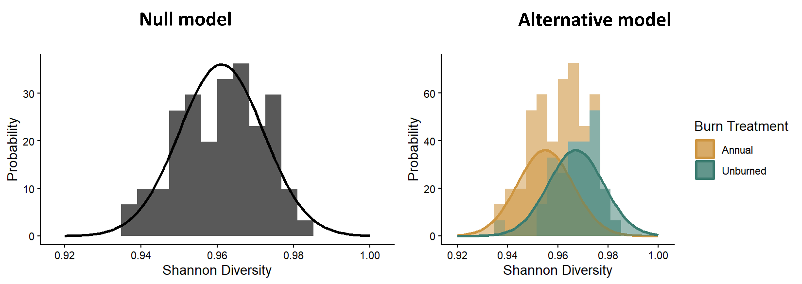
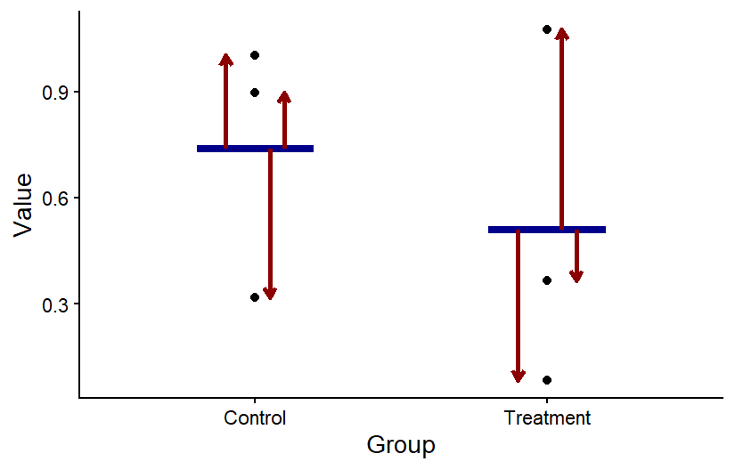
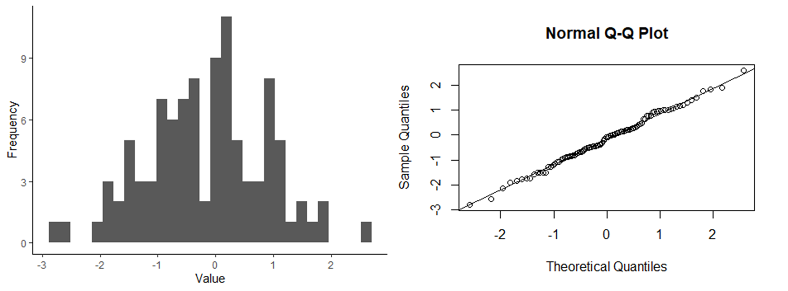
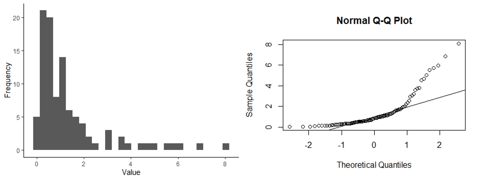
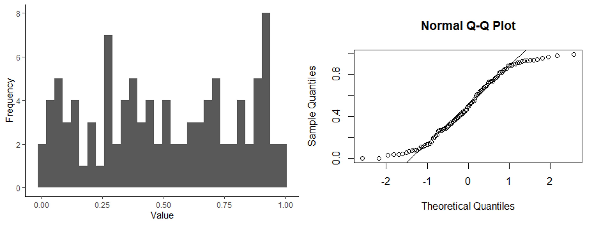
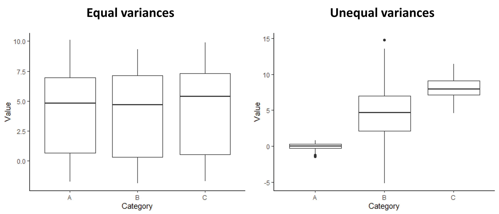

```{r setup, include=FALSE}
knitr::opts_chunk$set(echo = TRUE)
```

# Lesson 12: Assumptions and Transformations
In this lesson, we will cover the assumptions of t-tests and other similar models, how to test those assumptions in R, and what to do when the assumptions are violated. 

## 12.1 Conceptual background
When ever we use models, whether they are statistical models, mathematical models, or conceptual models, we make assumptions about the system we are trying to represent with those models. For statistical models, the assumptions we make are generally related to how our data were collected and the properties of the data (e.g., what type of variable: categorical, discrete, or continuous, the distribution of the variable, etc.). In this lesson, we will learn about the assumptions for t-test (and related models that we will learn later in the class), how to test whether our assumptions are met, and what to do if they are not. We will focus primarily on the assumption related to the properties of the data because the assumptions about data collection are related to topics we already covered when we discussed experimental design.

### Assumptions about data collection
T-test and similar models have two main assumptions related to data collection:

1. Samples are random
2. Samples are independent

These assumptions are related to some of the concepts that we covered when we discussed experimental design. If you follow guidance for randomly (or at least haphazardly) selecting samples and correctly identify the number of independent samples based on your experimental design, you should be good to go here. Sometimes, though, we intentionally incorporate non-independent samples into our experimental design, such as when we use random block designs or paired designs. In this case, we have to adjust for that design in our statistical analysis. That is exactly what we do when we run a paired t-test for a paired experimental design. We account for the non-independence by running the test on the difference in the non-independent pairs, rather than the raw data. When we do this, it also reduces the degrees of freedom in the analysis (recall that the degrees of freedom for a paired t-test is based on the number of pairs rather than the total number of data points). This adjusts for the fact that our samples are not independent, and we do not have as much independent information in our data set.

### Assumptions about data properties
There are two additional assumptions of t-tests that are related to the properties of the data themselves. To understand these assumptions, let's look back at the distribution graphs that represent out null and alternative hypotheses for a two-sample t-test, shown below. In these models, we specifically fit normal distributions to the data and test whether the data are best represented by a single normal distribution or two distributions with different means for each treatment group.

{width=80%}

<br>

The the math behind the t-distribution we use to determine the p-value (the probability of a t-statistic greater than or equal to ours assuming the null hypothesis is true) is based on the expectation that a normal distribution is a good fit for our sample distribution. Furthermore, in a standard t-test, we allow the means to vary in the alternative model, but the variances are the same between the two distributions, which we can see in the figure. This is reflected in the calculation of the t-statistic itself. The variation term in the denominator of the t-statistic is the pooled variance across both groups. You don't calculate separate variance terms for each group. These mathematical calculations of the t-statistic and t-distribution lead to our two assumptions related to the properties of the data:

1. The data (specifically the residuals of the data, which we will discuss in the next section) are normally-distributed.
2. The variances are equal between the two sample groups.

If you try to run a test if your data do not match these assumptions, the conclusion from the test might not be valid. We will dig into each of these assumptions in the sections below, focusing on how we test these assumptions and what we can do when the assumptions are not met.

### Normally-distributed residuals

#### What are residuals?
The residuals are the leftover variation in our dependent variable, after we have accounted for the variation explained by our independent variable. What this means in the context of a two-sample t-test is that we calculate the average value for each of our treatment groups, and then calculate the difference between the mean of the group and each individual data point in each group. The difference between the means of the groups is the effect of the independent variable, and the different between the means and each data point is the leftover variation, or the residuals. 

The graph below shows a visual representation of residuals. The points in the graph show the individual data points, the horizontal blue bars show the mean for each group, and the arrow showing the difference between the mean and each point represent the values of the residuals. When we run a statistical test, we can save the residuals from the output of the test to determine if they are normally-distributed. 

{width=60%}

<br>

#### Visualizing residuals
One of the best ways to determine whether our residuals are normally distributed is to make graphs of the residuals saved from a test and do a visual check of the distribution. We will look at two types of graphs to assess the distribution.

The first type of graph you can make is one that you are already familiar with: a histogram. If you histogram your residuals, you can visual determine if the histogram looks like the bell-curve we would expect for a normal-distribution. 

The second type of graph is called a q-q plot, or quantile-quantile plot. Quantiles are the boundary points when a set of data points is put in order and then divided into equal-sized subsets. A q-q plot graphs the quantiles that would be expected for a data set (such as the residuals from a statistical test) if it followed a normal distribution (or another type of distribution that you can specify) in comparison to the observed quantiles from the actual data set. If the values match, that indicates the actual data set does follow a normal distribution. Graphically speaking, this means that if you graph the theoretical residuals on the x-axis and the obersved residuals on the y-axis, the points will fall along the 1:1 line on the graph. If the points do not fall along the line, the residuals are not normally distributed.

Below are three sets of graphs that show a histogram of a data set along with a q-q plot for the same data set, so you can see what a q-q plot would look like for differently-shaped distributions. In the first set of graphs, the residuals are close to a normal distribution, and the points in the q-q plot fall close to the 1:1 line that is shown in the graph. In the second set of graphs, the distribution is skewed. In the q-q plots, the points fall close to the line in the middle, but at either end, they fall above the line. When the points fall above the line at both ends or below the line at both ends, that is what indicates a skewed distribution. Finally, in the last set of graphs, the ends (tails) of the distribution are thicker (have higher frequencies) than would be expected for a normal distribution. This results in a q-q plot with points that are above the line at the low end and below the line at the high end.

{width=80%}

<br>

{width=80%}

<br>

{width=80%}

<br>

#### Formal test for normally-distributed residuals.
In addition to visually assessing the distribution of your residuals, there are statistical tests that can be used to test whether residuals follow a normal distribution. In this class, the test we will learn for this is called a Shapiro-Wilks test. Like with most of the other tests we work with in this class, when we run this test, we start with our null and alternative hypotheses for the test. In this test, we are not making comparisons between variable, but instead we are comparing the distribution of a data set to a normal distribution. Therefore our hypotheses would be:

1. Null hypothesis: the data are normally-distributed.
2. Alternative hypothesis: the data are not normally-distributed.

We can then run the test, using the residuals saved after running a statistical test, which will give us a p-value. If the p < 0.05, we would reject the null hypothesis and conclude that the residuals are not normally-distributed. 

While it might seem like a formal statistical test like this is the best approach for ensuring that our residuals are normally-distributed, I urge you to use and interpret this test with caution. Like other statistical tests, it is sensitive to the sample size of the data set. If you have a large data set, the test will have a lot of power to detect even small deviations from a normal distribution, even if the deviations are small enough that they aren't a problem for running the test. In other words, the test is overly-sensitive. On the flip side, if you have a very small sample size, the test will not have a lot of power to detect deviations from a normal distribution, and you might fail to reject the null hypothesis, even if the residuals of your data are a problem.

In this class, if you want to use visual assessments and not run the Shapiro-Wilks test to check the assumption of normally-distributed residuals, that is fine (that is usually my approach). If you do run a Shapiro-Wilks test, however, you should not rely on that approach on its own. You should also use a histogram or q-q plot to do a visual check.

### Equal variances
#### Visualizing variances
Like with the assumption of normally-distributed variables, one of the best ways to check for equal variances is to graph the data and do a visual check. Good news: you already know a useful graph for this check! Boxplots are great for comparing the variation between sample groups. If you make a simple boxplot, you can compare the height of the boxes and whiskers between your groups to make sure they are roughly equal. The graphs below show an example of what a boxplot would look like for groups with equal variances compared to groups with unequal variances.

{width=80%}

<br>

#### Formal tests for equal variances
There is also a formal statistical test for comparing the variances across groups. It is called the Levene's test. The null and alternative hypotheses for a Levene's test are:

1. Null hypothesis: The variances are equal across the groups.
2. Alternative hypothesis: The variances are not equal across the groups.

For this test, we use our original data set (rather than the residuals saved after running a statistical test) because we are specifically comparing between groups, rather than looking at the total leftover variation after accounting for differences between the groups. If the test gives us a p-value less than 0.05, we would reject the null hypothesis and conclude that the variances are not equal.

This test comes with the same caution as the Shapiro-Wilks test. It can be overly-sensitive if you have a large sample size and not sensitive enough if you have a small sample size. Therefore, I am again fine with you only using a visual check (with a boxplot), but if you do run the test, you should be sure to do a visual check as well.

## 12.2 Testing assumptions in R
For this lesson, we will work with a new data set that contains data from an experiment that was done to test for the effect of invasive grass removal on the plant community. As a first pass, the researchers simply wanted to know if removing the grasses from the plot at the start of the growing season was effective for reducing the invasive grass cover in the plot at the end of the growing season. You will work with two variables from this data set. Your independent variable is weed removal (the name of this variable is "Weed" in the data set), and your dependent variable is grass cover (the name of this variable is "Grass_cover" in the data set). Because we have a categorical independent variable with two values and a continuous dependent variable, a t-test is an appropriate test for these data, if the assumptions are met.

Download the InvasiveGrass.csv file from Canvas. Set your working directory in R to the folder that contains the data file.

Then load your data file into R using the usual 'read.csv' function. I am calling the data object "grass" for this example.

```{r grass_data}
grass <- read.csv("InvasiveGrass.csv")
```

We will also use the **ggplot2** package for this lesson, so load that package now as well:

```{r load_packages}
library(ggplot2)
```

### 12.1 Testing for normality
The assumption normality for t-tests is that the residuals (the leftover variation that is not explained by our model) are normally distributed. Therefore, in order to test this assumption, we need to first run our model and save the residuals to test.

When we run the t-test this time, we will use a different function (the `lm` function) than we practiced in the previous lesson. We use the 'lm' function instead of the 't.test' function because the 't.test' function doesn't save the residuals from the test. However, the models built by the two functions are exactly the same, so the residuals are the same regardless of the approach we use to test the models. We can choose to use either function after checking our assumptions. We will store the test output in an object called "grass_ttest". Conveniently, the required arguments for running a t-test using the `lm` function are the same, and can use exactly the same format, as the `t.test` function we learned before.

```{r grass_ttest}
grass_ttest <- lm(Grass_cover ~ Weed, data = grass)
```

We will now save the residuals from the model using the `resid` function. Then we will store the residuals in a data frame, so we can graph them using `ggplot`. We will store the residuals in a data frame called "resids" and the variable name within the data frame will be "Residuals".

```{r grass_resid}
# Save residuals
grass_resid <- resid(grass_ttest)

# Store residuals in a data frame
resids <- data.frame(Residuals = grass_resid)
```

Now that we have saved our residuals, we can move on to testing whether they are normally distributed.

#### Histogram of residuals
The first way to check for normality of residuals is to make a histogram to determine if the residuals look like they are normally distributed, or at least symmetrical. We will makes this graph using the residuals that we saved from our model in the previous section. 

```{r residalt_hist}
ggplot(resids, aes(x=Residuals)) +
  geom_histogram() +
  labs(x="Grass cover", y="Frequency") +
  theme_classic()
```

Do the residuals look normally distributed?

#### qqplot
There is another type of graph that is useful for visualizing the normality of residuals, called a qqplot. This type of graph compares the residuals from a model with residuals that would be predicted based on a normal distribution. If we graph the residuals from our model against the predicted residuals, we would expect them to form a straight line if the residuals are normally distributed. If they do not form a straight line, that suggests the residuals are not normally distributed.

To make a qqplot to test for a normal distribution, we can use the `qqnorm` function. Then we can use the `qqline` function to add a reference line to the plot, showing where the points should fall if the data are normally distributed. The input (argument) for both of these functions in the object with our saved residuals (grass_resid).

```{r qqplots}
qqnorm(grass_resid)
qqline(grass_resid)
```

When the points fall close to the line like this, that means that the distribution of our residuals is close to normal. Based on both types of graphs, it looks like our data are normally distributed, but we'll cover a formal test for this as well.

#### Shapiro-Wilks test
The Shapiro-Wilks test is a formal test to determine if a distribution is normal. Our null hypothesis for this test is that the residuals are normally distributed.

Running the test is pretty straightforward. We will use the `shapiro.test` function, and the only argument we need to input is our residuals from the models we built.

```{r shapiro}
shapiro.test(grass_resid)
```

Based on the output of the tests, are the residuals normally distributed?

Remember, though, there are downsides to this test. When you interpret the results, be sure to interpret them in the context of your sample size.

### 12.2 The log transform
We have established that our data are normally distributed, but what if they weren't? What would we do about it? 

If our residuals are not normally-distributed, particularly when we have skewed data, often a good option is to log transform our data. The log-transformed data will often be more normally distributed, and if they are, we can run our test on the log-transformed data. Even though our residuals are okay in this example, let's try this transformation on our grass data and see what effect it has, just for practice!

There is one catch before we do the log transform: we have some zeroes in our grass cover data, and the log of zero is undefined. Because there are only a few zeroes, we will add a small values to these zeroes before doing the transform. Based the the grass cover values, which are mostly between 0 and 1, we will use 0.01 as our small value.

To add this value, we first have to figure out which grass cover values are equal to zero. We can use the handy 'which' function, which tells us which values in a vector fit a particular criteria (in this case, being equal to zero). We have to input the data frame and variable names ('grass$Grass_cover'), as well as the criteria ('==0'). We will save the position of the values that fit our criteria in an object called "indexes".

```{r index}
indexes <- which(grass$Grass_cover==0)
```

We can use the indexes to change the values from zero to 0.01. In the code below, 'grass$Grass_cover[indexes]' will tell R to pull out the values that we identified as being equal to zero, and '<- 0.01' will change them to 0.01.

```{r addvalue}
grass$Grass_cover[indexes] <- 0.01
```

Now we can log-transform our data and add a new column to the grass data frame to store our log-transformed grass cover data. I am calling the new variable "log_Grass_cover".

```{r ln_transform}
grass$log_Grass_cover <- log(grass$Grass_cover)
```

Finally, we will check to see if the log transformed data are normal, using the same approach as above.

First, run the t-test, this time using "log_Grass_cover" as our dependent variable, save the residuals, and put them in a data frame.

```{r grass_lmlog}
grass_ttest_log <- lm(log_Grass_cover~ Weed, data=grass)

resid_log <- resid(grass_ttest_log)

resids_log <- data.frame(Residuals = resid_log)
```

Now, we will make our graphs to check normality. Start with the histograms:

```{r residlog_hist}
ggplot(resids_log, aes(x=Residuals)) +
  geom_histogram() +
  labs(x="log Grass Cover", y="Frequency") +
  theme_classic()
```

Next, make the qqplots:

```{r qqplots_log}
qqnorm(resid_log)
qqline(resid_log)
```

And finally, we'll run the Shapiro-Wilks test on the new residuals:

```{r shapiro_log}
shapiro.test(resid_log)
```

Because our residuals were okay to begin with, after log-transforming the data makes them look worse! It's definitely better to proceed with the un-transformed data so far, but we need to check our other assumption first.

### 12.3 Testing for equal variances
Another assumption of linear models is that the variance of our dependent variable is equal for different values of our independent variable. 

For this one, we do not need to run the models first to save residuals, so let's jump right into the testing.

#### Graphs to visualize variance
We will start with a simple visual test: making a box plot to compare the variation between the different categories.

```{r cone_boxplot}
ggplot(grass, aes(x=Weed, y=Grass_cover)) +
  geom_boxplot() +
  theme_classic()
```

It looks like the variances are pretty different between the two groups, so we seem to have a problem here, but we will look at the results of a formal test for equal variances too.

#### Levene's test
Levene's test is a formal test that will check for equal variances. Note that is tends to be a bit sensitive, so it will sometimes pick up small differences in the variances that are not a problem, particularly if you have large sample sizes. With the Levene's test, we are testing the null hypothesis that the variances are equal. Therefore if the p-value is less than 0.05, that suggests that the variances are not equal.

The function for the Levene's test is in the `car` package, so install (`install.packages("car")`) and load that package first.

```{r install_car}
library(car)
```

Now we can run the test:

```{r levene}
leveneTest(Grass_cover ~ Weed, data = grass)
```

Don't worry if you get a warning message. It is just telling you that when it ran the test, it converted "Weed" from a character variable to a factor variable. Take a look at the p-value for the test. Based on this p-value, are the variances equal?

### 12.4 The square root transform
We have established that we don't have equal variance between our categories, so what can we do? The first thing we can try is transforming our data. If our data are skewed (not normally distributed), a log transform might help. However, if our data have a pretty symmetrical distribution (which we already determined they do), a log transform is unlikely to help. Instead, we can try a square root transform. Let's see if that helps here.

Like with the log transform, we will add a new variable to our data frame, but this time we will take the square root of our grass cover variable.

```{r sqrt_trans}
grass$sqrt_Grass_cover <- sqrt(grass$Grass_cover)
```

Now, we can use our tests again to see if this helped.

Start with the boxplot:

```{r sqrt_boxplot}
ggplot(grass, aes(x=Weed, y= sqrt_Grass_cover)) +
  geom_boxplot() +
  theme_classic()
```

It looks a lot better now, but we will check our Levene's test too.

```{r levene_sqrt}
leveneTest(sqrt_Grass_cover ~ Weed, data = grass)
```

Okay, it looks good, so our transform worked. We can now safely run a t-test using the square-root-transformed data.

### 12.5 Running the test
At this point, we can test the model using either a classical frequentist approach or a maximum likelihood approach. I will show both methods here, but, again, note that this is just for the purposes of demonstration. Normally, you would just choose one approach to use.

#### Classical frequentist
To run a t-test using the classical frequentist approach, we will use the same t.test function that we learned in the last lesson. Note, however, that we now want to use the square-root-transformed variable ("sqrt_Grass_cover") instead of the raw grass cover variable.

```{r ttest_sqrt}
grass_ttest_sqrt <- t.test(sqrt_Grass_cover~Weed, data=grass,var.equal=TRUE)
grass_ttest_sqrt
```

Based on the p-value, would you reject the null hypothesis that weed removal does not affect end-of-season grass cover?

#### Maximum likelihood approach
Just like the last lesson, to use the maximum likelihood approach, we start by using the 'lm' function to build both the null and alternative models. Then we use the 'AIC' function to compare the AIC values for the two models. Remember, the model with the lower AIC value is the better model for our data.

```{r lm_test}
# Build models
grass_null <- lm(sqrt_Grass_cover~1, data=grass)
grass_alt <- lm(sqrt_Grass_cover~Weed, data=grass)

# Compare AIC values
AIC(grass_null, grass_alt)
```

Which model is best? Is it significantly better than the other model?

### 12.6 Welch's tests
If the variances still aren't equal after transforming the data, we can use a test, called the Welch's test, that doesn't assume equal variances. This will work for both a t-test and and ANOVA. Even though our square root transform did work in this example, let's practice how to do a Welch's test.

To run the Welch's test, we will use the same 't.test' function that we used for a regular t-test, but we will change one argument. Instead of using the "var.equal=TRUE" setting, we will change it to "var.equal=FALSE". Notice that we can run this test will the un-transformed Grass_cover variable because with this test, it is fine if the variances are not equal.

```{r welch}
t.test(Grass_cover~Weed,grass,var.equal=FALSE)
```

The output is similar to what you have seen before. You should see the t statistic, the degrees of freedom (df) and the p-value. Note that the df is a little different here that what you would get with a regular t-test. This is because we lose more degrees of freedom with the Levene's test because we are calculating separate variances for each group.

Note that the conclusion you would draw based on the Welch's test using the un-transformed grass cover data is the same conclusion you would draw using the regular t-test on the square root transformed grass data.

### Practice problems
Use the steps below to test out this process on a different data set! You will work with data on the impact of mycorrhizal inoculation on plant density. Download the mycorrhizae.csv file from Canvas. When you are ready to start working with the data in R, be sure to set your working directly, load the data set, and load the **ggplot2** package before proceeding.

1. What are your null and alternative hypotheses for this question?
2. Build model using the 'lm' function. Save the model residuals.
3. Use a histogram and a qqplot to determine if the residuals are normally-distributed. You may also use a Shapiro-Wilk's test as a formal test, if you would like.
4. Use a boxplot and a Levene's test to check for equal variances.
5. Based on your exploration in questions 3 and 4, select an approach for addressing any violations of the assumptions.
6. Run an appropriate test (addressing any violations of assumptions) to answer the original question (Does mycorrhizal inoculation affect plant density?). You may choose between a classical frequentist or maximum likelihood when you run this test.
7. Write you conclusions, including any necessary statistics backing them up.

I will post an answer key to these questions next week.