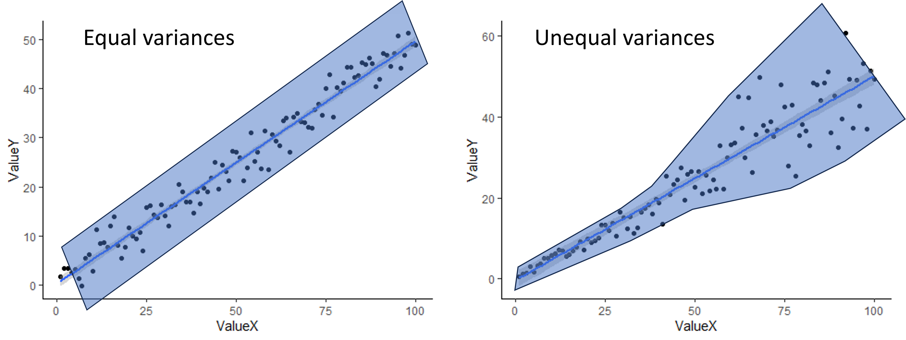

```{r setup, include=FALSE}
knitr::opts_chunk$set(echo = TRUE, message=FALSE, warning=FALSE)
```

# Lesson 14: Correlation and Linear Regression
In this lesson, you will tackle tests that can be used when you have two continuous variables: correlations and linear regressions. We will start by covering when each type of test is used, and then cover the conceptual background of the tests. Finally, you will practice running the tests in R.

## 14.1 Conceptual background

### Correlation versus linear regression
While both correlations and linear regressions are used to test relationships between two continuous variables, there are important distinctions between the two, so it is important to understand when one is used versus the other. 

Correlations simply measure the strength and direction between two variables. You have probably heard the trope, "correlation does note equal causation." Trope it may be, but it important to keep in mind here. Correlation tests are used when we think there might be a relationship between two variables, but not necessarily a causal relationship. In fact, it does not distinguish between an independent and dependent variable because it is used when there are not clear independent and dependent variable. For example, we might expect there to be a relationship between the diameter of a tree and the height of the tree. However, an increase in diameter does not *cause* and increase in the height, nor does an increase in height cause an increase in diameter. Diameter and height just tend to increase at the same time as the tree grows.

In a linear regression, on the other hand, assumes a cause-and-effect relationship between our variables. In other words, there is a clear independent variable and dependent variable. (Note that a regression *assumes* a cause and effect structure, but that does not mean that getting a significant effect in a linear regression *proves* a causal effect. Proving cause-and-effect depends on a well-designed experimental approach.) When we run a linear regression, we don't just get a measure of the relationship between our variables, we get an equation for the relationship between our variables that determines how to predict the value of our dependent variable from the value of our independent variable. We therefore use linear regressions in two cases:

1. When we have reason to think there is a causal relationship between our variables.
2. When we want to predict the value of one variable from the other variable, even if there is not a causal relationship between the two. (For example, we would normally use a correlation to measure the relationship between tree diameter and tree height, as discussed above, but it we ultimately wanted to use measurements of tree diameter to estimate tree height, we would run a linear regression using diameter as the independent variable and height as the dependent variable. This would give us the equation we would need for estimating the height.)

### Correlations
A correlation tests measures the strength and the direction of a relationship between two variables by calculating a statistic known as a correlation coefficient (r). There are different version of correlation coefficients, but they calculate the strength and direction of the relationship in some way. The default correlation coefficient in the R function we will use is the Pearson's correlation coefficient. We won't cover the equations for correlation coefficients in this class, but we will go over what they measure and what they don't. 

Correlation coefficients can range in value from -1 to 1. The sign of the coefficient tells you the direction of the relationship. As you can probably guess, a negative coefficient means there is a negative relationship between the two variables and a positive correlation coefficient means there is a positive relationship between the two variables. The magnitude of the correlation coefficient, whether positive or negative, is a measure of the strength of the relationship. But what do we mean by the strength? A strong relationship means that as one variable increases, the other variable increase or decreases at a fixed rate. In other words, if we drew a straight line through the data points to represent there relationship, the points would fall directly on the line if they were perfectly correlated (a correlation coefficient of -1 or 1). However, the correlation coefficient does not reflect the slope of that line. You would get a coefficient of 1 if the points fall perfectly on the line whether the slop of that line is 0.2 or 2. Wikipedia has a nice <a href="https://en.wikipedia.org/wiki/File:Correlation_examples2.svg">illustration</a> of what is measured by the correlation coefficient and what isn't. If you want to develop better intuition of what a correlation coefficient tells you about the data, you can also try playing this <a href="https://www.guessthecorrelation.com/">Guess the Correlation game</a>!

With some software/functions, when you run a correlation test, the only statistic you get is the correlation coefficient. With others, including the one that we will use in R, you also get the output of a statistical test that compares the correlation coefficient to zero (no correlation) to tell you if the correlation between your variables is statistically significant. This test is similar to a t-test (in fact, it uses a t-statistic and t-distribution to calculate a p-value). It tests the null hypothesis that the correlation coefficient is equal to zero. Like with the other tests we have covered, if p < 0.05, we would reject the null hypothesis and conclude that there is a significant correlation between our variables.

### Linear regressions
A linear regression test models the relationship between an independent variable and a dependent variable by fitting a line to the data to represent the relationship between the two variables. This line can be described by the standard equation for a line, with an intercept and slope (usually represented by $\beta_0$ and $\beta_1$, respectively), where the slope is the effect of the independent variable on the dependent variable. The equation for the best fit line is determined by finding the line that minimizes the total value of the residuals (the leftover variation not explained by the model). Luckily, computers can use an algorithm to figure this out for us.

Once we have the equation for the line, the linear regression test with test the statistical significance of the relationship between the two variable. Because the slope represents the effect of the independent variable on the dependent variable, with a slope of zero meaning there is no effect, this test is essentially measuring whether the slope term is significantly different than zero. Our null and alternative hypotheses are therefore:

* Null: The slope of the relationship between the independent variable and the dependent variable is 0 ($\beta_1 = 0$)
* Alternative: The slope of the relationship between the independent variable and the dependent variable is not 0 ($\beta_1 \neq 0$)

As with an ANOVA, we test the null hypothesis by calculating the F-statistic and then using the F-distribution to calculate the probability (p-value) of an F-statistic equal to or more extreme than ours, assuming the null hypothesis is true. The F-statistic is once again a signal to noise ratio. It is the amount of variation in the dependent variable that is explained by the independent variable (the signal - similar to the difference in means between groups in an ANOVA) divided by the leftover variation (the noise - similar to the within-group variation in an ANOVA). Once we have our p-value, we interpret it as usual and reject the null hypothesis if p < 0.05.

Another important piece of output from a linear regression is the $r^2$ value. This is similar to the correlation coefficient in a correlation test. The $r^2$ value is a measure of the amount of variation in the dependent variable that is explained by the independent variable. In other words, it is a measure of how close our data points fall to the best fit line. There is, in fact, a direct relationship between the $r^2$ value and the correlation coefficient: the $r^2$ value is the square of the Pearson's correlation coefficient. This is a different piece of information that what we get from the p-value in a linear regression, which tells us if the slope is significantly different than zero. You can get a statistically significant p-value and have a lot of scatter, which generally means that while your independent variable has a significant effect, there are other variables not included in your model that are important as well. It is therefore important to include the $r^2$ value along with the other output from the statistical test.

### Assumptions of correlations and regressions
The assumptions of correlations and regressions are similar to the assumptions for t-tests and ANOVAS. For the experimental design assumptions, they still assume that samples were randomly selected and are independent. For the data properties, we still have the assumptions of normality and equal variances. 

One slight twist on the assumption of normality for the correlation test is that, because we are simply testing for the relationship between two variables, we don't have residuals. Instead the assumption is that the two variables have normal distributions. However, you can still test the distributions of the variables using histograms, qqplots, and/or a Shapiro-Wilks test.

To check for equal variances when you have two continuous variables, you can simply look at the scatter plot you make to visualize your data. If the scatter around the line is fairly equal along the whole line, you are good to go. If you have very little scatter at one end of the line and a lot of scatter at the other end, you probably have a problem. An example of both is shown below. The shading shows an outline of the scatter to give a better visual.

{width=80%}

<br>

#### When assumptions are not met
Just like with a t-test or ANOVA, usually the best approach to try first when your assumptions are not met is a data transformation (log transform for skewed residuals/variables or square-root tranform for unequal variances). If a data transformation doesn't work, you can use alternative tests.

For a correlation, if the variances are not equal, the variables are not normally distributed, and/or the relationship is not linear, you can use a different correlation coefficient. The default in the R function we will use, the Pearson correlation coefficient, does assume equal variances, normal distributions, and linearity, but there are two other options you can choose for the function, Spearman and Kendall, that are non-parametric and do not make these assumptions. They can also be used with discrete data, like count data, and ordinal data (categorical data with an ordered rank between the values). While they do not assume linearity, they do only work it there is either a consistently increasing relationship or a consistently decreasing relationship between the variables. The University of Virginia has a nice <a href="https://library.virginia.edu/data/articles/correlation-pearson-spearman-and-kendalls-tau">article comparing Pearson, Spearman, and Kendall correlations</a>.

For linear regressions, there are also other types of tests that can be used when the assumptions aren't met, which can include tests that assume a different distribution, modifications to a simple linear regression that allow for non-linearity, and types of regression that are robust to violations of the assumptions (robust regression). We won't cover those tests in this class, but if you are interested in exploring some of these tests on your own, here are some resources.

* <a href="https://tysonbarrett.com/Rstats/chapter-5-generalized-linear-models.html">R for Researchers: Generalized linear models</a>
* <a href="https://tuos-bio-data-skills.github.io/intro-stats-book/non-linear-regression-in-R.html">TUOS Introductory Biostatistics with R: Nonlinear regression</a>
* <a href="https://www.r-bloggers.com/2020/12/robust-regression/">R Bloggers: Robust regression</a>

## Lesson 14.2: Correlations and regressions in R
For our correlation and linear regressions test, we will be using a data set on the effect of climate (precipitation and temperature) on the growth rate of an endangered plant (softleaf paintbrush - *Castilleja mollis*) on Santa Rosa Island in California.

First, load the data set and **ggplot2** package. Be sure your working directory is set correctly.

```{r plant_data}
plant <- read.csv("cm_growthdata.csv")
library(ggplot2)
```

### Correlations in R
For our correlation analysis, we are going to look at correlations between the two climate variables in our analysis. Looking at the relationship between climate variables is a good use of a correlation analysis because often different climate variables are related to each other, but the relationship is not causal, at least not directly. The two variables we will test are: total precipitation from January to April (Rain_Jan_April
) and the difference between growing season temperature and the 10-year average for growing season temperature (Difference_mean_temperature). 

#### Visualizing our data

To visualize relationships between two continuous variables, a scatterplot is a good approach. With a correlation, we don't always add a best fit line (the best fit line is the output of a regression analysis). Note that because we don't have a clear independent and dependent variable, it doesn't matter which variable you choose as the x and y variable.

```{r corr_scatter}
ggplot(plant, aes(x=Rain_Jan_April,y=Difference_mean_temperature)) +
  geom_point() +
  labs(x="Growing season precipitation", y="Growing season temperature deviation") +
  theme_classic()
```

Based on the graph, is there a strong relationship between the variables?

If you want to look at correlations between more than two variables, you can make a graph that shows the pairwise relationships between each pair of variables. You could do that with completely separate plots for each pair, but there's a faster way! With the `pairs` function, you can generate a grid of plots that shows the relationship between all pairs of variables we want to include in our analysis. You just provide a formula with the variables we want to include and the data set from which they come. Here is a general example of what the syntax would look like for the `pairs` function, in case you ever need it. It can be extended to include more that three variables as well.

```{r corr_plot, eval=FALSE}
pairs(~ Variable1 + Variable2 + Variable3, data = Dataframe) 
```

In the output from a pairs plot, you would see the variables on the diagonal and the scatterplot for each pair of variables. (Note that the plots below the diagonal are just repeats of the plots above the diagonal, but with the axes switched).

While we are visualizing things, let's also make histograms of the variables to check for normality. Since these graphs are just for the purpose of checking assumptions and don't need to be pretty, we can use the quick and dirty `hist` function in base R instead of using ggplot (this is always fine when you are just making graphs to check assumptions). 

```{r hists}
hist(plant$Rain_Jan_April)
hist(plant$Difference_mean_temperature)
```

These are not quite normal, but they aren't very skewed either, so let's run with it.

#### Running the correlation test
Now we will run a formal test to see if the correlations are significant. We will just use the base R function `cor.test`, which will give us a correlation coefficient and run a significance test to test the significance of the correlation (i.e., is the correlation coefficient signficantly different than zero?).

To run the pairwise tests, we'll use the `with` function in combination with the `cor.test` function, to pull out the two variables we want from the plant data set and run the correlation for those two variables.

```{r corr_test}
cor.test(plant$Rain_Jan_April,plant$Difference_mean_temperature)
```

In the output of the test, we can see the results of the significant test at the top. In this case, our p-value is 0.49, so we would fail to reject the null hypothesis. There is not a significant correlation between our two climate variables. At the bottom, we can see the value of the correlation coefficient. Ours is negative, suggesting a weak negative relationship between the variable, but the value is very close to zero - hence the non-significant correlation.

### Simple linear regression
In this first section, we will individually test the effects of precipitation and temperature on the growth of softleaf paintbrush (Growth_rate) To begin, we will visualize the relationships using scatterplots. We will also include a best fit line. We'll make two graphs, one for each of our independent variables. If you haven't already, load the `ggplot2` package first.

```{r plant_scatter}
ggplot(plant, aes(x=Rain_Jan_April, y=Growth_rate)) +
  geom_point() +
  geom_smooth(method="lm")+
  labs(x="Growing season precipitation", y="Growth rate") +
  theme_classic()

ggplot(plant, aes(x=Difference_mean_temperature, y=Growth_rate)) +
  geom_point() +
  geom_smooth(method="lm")+
  labs(x="Growing season temperature deviation", y="Growth rate") +
  theme_classic()
```

These two graphs show the relationships between the two variables, but we can also use them to check our assumptions of equal variances and linear relationships. In both graphs, it looks like the variances are fairly equal across the graphs, and the relationships don't show any clear non-linearity, so we are fine there.

#### Running the test
Now we will run the statistical tests. We can do this using the same `lm` function that we used for getting the residuals for t-tests and ANOVAs (hint: t-test, ANOVAs, regressions, and tests with multiple independent variables can ALL be run using the lm function!).

```{r plant_lm}
plant_precip <- lm(Growth_rate ~ Rain_Jan_April, plant)
plant_temp <- lm(Growth_rate ~ Difference_mean_temperature, plant)
```

Before we looks at the output of the models, let's do a quick check of the residuals, to ensure that our assumption of normally-distributed residuals is met. We'll again use our quick and dirty `hist` function.

```{r residcheck}
hist(resid(plant_precip))
hist(resid(plant_temp))
```

The residuals look pretty good, so now let's view the output of the models. To view the output of your models, type the name of each model. Each model will have a intercept and a slope term for the effect of either precipitation or temperature on plant growth. Based just on the slope term, what are the effects of temperature and precipitation, and how strong are they?

To view the additional output, including the test of significance, use the `summary` function.

```{r lm_out}
summary(plant_precip)
summary(plant_temp)
```

When you view the output, you will see a number of things. First, you will be able to see the the formula you used to build the models. Then you will see some information on the distribution of the residuals (the leftover variation not explained by your model). Next, you will see the coefficients from your model, along with standard error of the estimates. The coefficients section will also show you t-values and p-values for each coefficient. These are one-sample t-tests comparing the value of the coefficient to zero (similar to the t-test run to test for significant correlations!).

The information we really want for our linear regression test is down at the very bottom. In the final section, you will see some R-squared values. Remember, these are a measure of how much variation in your dependent variable is explained by your independent variable. Below that, you will see the output of the linear regression test. First is the F-statistic (the same statistic that was calculated for the ANOVA). Then you will see the p-value. For our precipitation model, we can see that the p-value is greater than 0.05, so there is not a significant effect of precipitation on plant growth. For the temperature model, however, the p-value is less than zero, so there is a significant effect of temperature.

Here we tested the effect of precipitation and temperature using separate regression test. In the next lesson, we will cover how to work with multiple predictor variables in a single analysis!