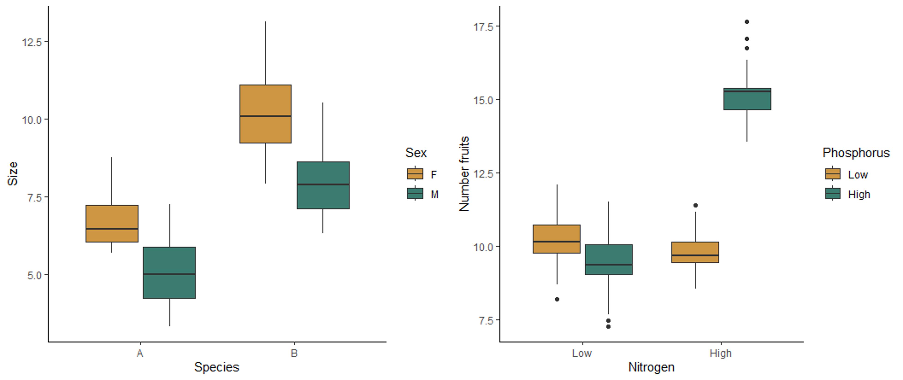
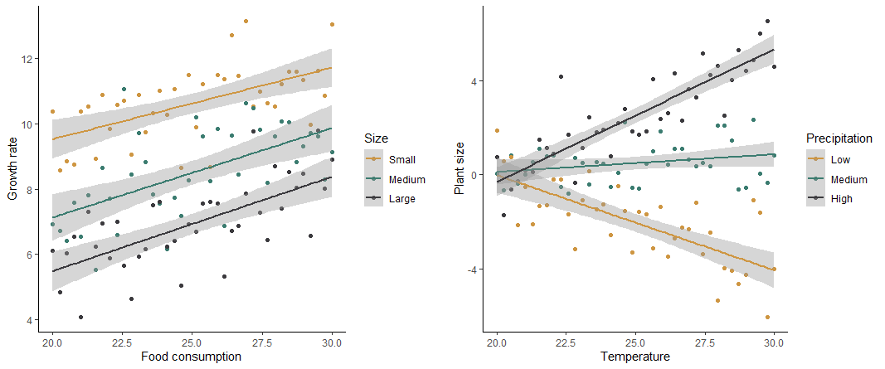

```{r setup, include=FALSE}
knitr::opts_chunk$set(echo = TRUE)
```

# Lesson 15: Multiple Predictors
In the previous lessons, we have worked with models that have only one independent and one dependent variable. However, it is common to have more than one independent variable that we would like the test. This is often particularly true when we do observational studies, and there are a whole suite of variables that might affect the response we measure. In this lesson, we will cover models with multiple predictors. We will focus on examples with only two predictors, but the methods can easily be extended to include more than two predictors as well.

For these examples, we will switch our statistical approach and use an information criterion approach, which can be more powerful for testing multiple alternative hypothesis. However, similar tests can be done with a classic frequentist approach, using two-way ANOVAs, ANCOVAs, and stepwise (multiple) regression, for the three examples, respectively. We will review the information criterion approach, and then work through three examples with different types of predictor variables.

## 15.1 Conceptual background

### An information criterion approach
The classical frequentist approach to statistical testing that we have covered so far (Chi-square test, t-test, ANOVA, etc.) is focused on testing the null hypothesis. When we draw our conclusion we either decide to reject the null hypothesis or fail to reject the null hypothesis. This approach is most useful when you have a specific null hypothesis that you want to test, compared to a single alternative hypothesis. It does not work as well when you have multiple alternative hypotheses that you are trying to compare, which is the case when we have multiple predictor variables.

Information-criterion statistics information criterion statistics work by comparing multiple hypotheses to each other rather than just testing the null hypothesis. If you have multiple hypothesis about different predictor variables, you can simultaneously compare those hypotheses to each other. Because of this, information-criterion statistics are often better suited for questions involving multiple independent variables or different model structures. 

Information-criterion statistics work by testing each of your hypotheses one at a time and calculating the probability of observing your specific data set, assuming that hypothesis is true. This probability is known as the likelihood value. The higher the likelihood value, the better the hypothesis is for explaining your data. These statistics also penalize for the complexity of the model (because a more complex model will always result in at least a slightly higher probability), so ultimately the model deemed as best is the simplest model that has the highest probability of leading to your data. The likelihood and the complexity of the model are combined together into a single value called an information criterion. The specific type of information criterion that we will work with in this class is called Akaike's Information Criterion (AIC).

Because this type of statistics considers all of your hypotheses, not just the null hypothesis, it can be used to rank your hypotheses from best to worst. However, you can also use a threshold to select one model as the best. Usually if there is a difference of two or more in the AIC values between two models, the model with the **lower** value is selected as significantly better (lower information criterion means higher likelihood and lower complexity of the model). If one of your alternative models comes out on top, you can then conclude that the independent variables included in that model have a significant effect on your dependent variable.

### Hypotheses for multiple predictors
Just like when we used classical frequentist statistics for models with a single independent variable, when we test models with multiple predictors, we start by identifying our hypotheses. The main difference here is that, when we have multiple predictors, we also have multiple alternative hypotheses. In this class, we will only work with models that have two predictor variables, so here we will focus on the hypotheses for two predictor variables. However, this could be extended to include more than two predictors.

Let's say we have two predictor variables that we will call "Variable 1" and "Variable 2". As usual, our null hypothesis is the hypothesis of no effect. When we have two predictor variables, our null hypothesis is that *neither* of our two predictor variables affect our dependent variable. We then have four different alternative hypothesis about our two different predictors and how they relate to each other:

1. Variable 1 has an effect (but not Variable 2)
2. Variable 2 has an affect (but not Variable 1)
3. Variable 1 and 2 have effects, but they do not interact
4. Variable 1 and 2 have effects, and they interact

The first two hypotheses are pretty straightforward, but what do we mean by the variables interacting (or not) in our third and fourth hypotheses? When our predictor variables do not interact, that means the effect of one variable is the same, regardless of the values of the other variable. If they do interact, that means the effect of one variable depends on the value of the other variable. When you run models with multiple predictors in R, you will get coefficient values that represent possible interaction effects. However, I find them much easier to interpret visually, so let's look at some examples of graphs with and without interaction effects.

The boxplot on the left below shows the effect of sex and species on the size of millipedes. Both sex and species affect the size, but they do not interact with each other. Regardless of the sex, species B is larger than species, and regardless of species, females are larger than males. Therefore the effect of each variable does not depend on the other variable. The boxplot on the right shows the effect of nitrogen and phosphorus on the number of fruits produced by a plant. This plot shows an interaction affect. When nitrogen is low, there is not effect of phosphorus. However, when nitrogen is high, more fruits are produced when phosphorus is also high. Similarly, when phosphorus is low, nitrogen has no effect, but high nitrogen leads to higher fruit production when phosphorus is high. The effect of one variable therefore depends on the the other variable, meaning the two variables interact with each other.

{width=80%}
<br>

In the scatter plots below, the graph on the left shows no interaction between how size and food consumption affect the growth rate of mice. For all sizes, an increase in food consumption leads to an increase in growth rate, and for all levels of food consumption, smaller mice have a higher growth rate. The graph on the right shows the effect of temperature and precipitation on plant size, with an interaction between the two effects. When precipitation is low, an increase in temperature has a negative effect on plant size. However, when precipitation is high, an increase in temperature has a positive effect on plant size. At low temperatures, precipitation has no effect on plant size, but at high temperatures, precipitation has a a positive effect on plant size. The effect of both variables depends on the value of the other variable.

{width=80%}
<br>

Because of the potential for the effect of one variable to depend on another when we have multiple predictors, it is therefore important to check for both the main effects of our predictors as well as possible interactions between the variables.

### Testing the hypotheses
Once we have identified the hypotheses for our question, we can use the Akaike's Information Criterion (AIC) to compare our models. Because we compare all of the hypotheses to each other instead of just testing the null hypothesis, we do this by building a model to represent each of the hypotheses and calculate an AIC value for each model. Models with a higher probability of producing the data and lower complexity (e.g., fewer predictors) are considered to be the better models, and they will have lower AIC values. If a model has an AIC value that is more than 2 lower than another model, it is significantly better than the other model. We can then determine the significance of the effects of the predictors, and any interaction between the predictors, based on the effects that are included in the best model. For example, if the model with both predictors and an interaction effect is the best, then we can conclude that both predictors have a significant effect, and the effect of one predictor depends on the others. If the best model includes just one predictor, then we can conclude that the variable included in that model has a significant effect, but the other predictor has not.

Below you will learn how to graph data with multiple predictors and build and test the models.

## 15.2 Running the tests in R

We will use both the **ggplot2** and **dplyr** packages in this lesson, so load those before you get started.

```{r load, message=FALSE}
library(ggplot2)
library(dplyr)
```

### Two categorical variables
For our first example, we will work with two categorical predictor variables. We will use a data set from a medical test related to hyptertension. One common cause of hypertension is high sodium levels, which are controlled in part by an enzyme in the kidney called Na-K-ATPase. Researchers tested the activity of Na-K-ATPase in two strains of lab rats: a control strain and a strain selected to spontaneously develop hypertension. They wanted to know if Na-K-ATPase activity varied between these two strains and, if so, what sites in the kidney varied in their enzyme activity. The two independent variables are the rat strain (normal or hypertensive) and the kidney site (DCT, CCD, or OMC).

#### Visualizing and building the models

We'll start off by loading and visualizing our data. Download the **kidney.csv** file from Canvas. Be sure your working directory is set to the location of the kidney data file and load the data set.

```{r kidney_data}
kidney <- read.csv("kidney.csv")
```

Now, let's make a box plot to visualize our data set. We will put site on the x-axis and group and color our boxes by lab rat strain (hypertensive or not).

```{r kidney_boxplot}
ggplot(kidney, aes(x=site, y=enzyme, fill=hyper)) +
  geom_boxplot() +
  scale_fill_manual(values=c("#ce9642","#3b7c70")) +
  labs(x="Kidney Site", y="Enzyme levels", fill = "Strain") +
  theme_classic()
```

Based just on the graph, what patterns do you see in the data. Do the strains differ in their enzyme activity? What the kidney sites? Does there appear to be an interaction between the two variables?

When you are working with categorical data, you can also use the `summarise` function to get the mean values for each of your groups, if you would like. You will want to group your data by both of your independent variables before summarizing:

```{r summarise}
grouped <- group_by(kidney,site,hyper)
kidney_summary <- summarise(grouped,Mean_enzyme=mean(enzyme))
kidney_summary
```

Now let's proceed with building our models. Again, we will have multiple alternative models representing four different hypotheses: (1) only strain matters, (2) only site matters, (3) both strain and site matter but don't interact, (4) both strain and site matter and they interact. The models are built in this order after the null model below.

```{r kidney_lm}
kidney_null <- lm(enzyme ~ 1, data = kidney)
kidney_hyper <- lm(enzyme ~ hyper, data = kidney)
kidney_site <- lm(enzyme ~ site, data = kidney)
kidney_both <- lm(enzyme ~ hyper + site, data = kidney)
kidney_int <- lm(enzyme ~ hyper*site, data = kidney)
```

You can view the output of your models by typing the name of each model or using the summary function. I personally find it difficult to interpret what the interaction looks like just based on the coefficients. This is where our graphs can come in handy. Looking at our boxplot can help us see the nature of the interaction, if any, between our variables.

Before we move on to testing our models, lets also check our assumption of normality. We will save the residuals from each model and look at the associated qqplots (you could make histograms instead if you find those easier to interpret).

```{r kidney_resid}
resid_null <- resid(kidney_null)
resid_hyper <- resid(kidney_hyper)
resid_site <- resid(kidney_site)
resid_both <- resid(kidney_both)
resid_int <- resid(kidney_int)
```

```{r kidney_qq}
qqnorm(resid_null)
qqline(resid_null)

qqnorm(resid_hyper)
qqline(resid_hyper)

qqnorm(resid_site)
qqline(resid_site)

qqnorm(resid_both)
qqline(resid_both)

qqnorm(resid_int)
qqline(resid_int)
```

When you check the residuals for multiple competing models like this, you might find they look good for all of the models, they look bad for all of the models, or they look good for some models but bad for others. If they look good for all models, it's of course fine to proceed. If they look bad for all models, that's when you should try transforming your data. If you get a mix of good and bad, that likely means that some of the models (the ones with the bad residuals) are not as good for explaining the patterns in your data. You can proceed with the test and factor in the residuals as another consideration for which model best represents your data.

Here, the distributions of the residuals probably aren't normal for most of the models, but there is also no sign of a lot of skew. The ones that are not normal are probably fairly flat distributions. Therefore, we can probably be comfortable moving ahead with the tests.

You can look at the box plot you alreay made to check variances. They don't look great, but (I can tell you because I tried it), both square root and log transforms will make it worse, and our sample sizes are equal, so I recommend proceeding with the test.

#### Testing the models
Now we will use the likelihood approach and `AIC` function to compare our models, just like we did with the millipede models. 

```{r kidney_AIC}
AIC(kidney_null,kidney_hyper,kidney_site,kidney_both,kidney_int)
```

Based on the output table, we can see that the interaction model has the lowest AIC values, by more than two points. That tells us that both site and strain matter, and they interact. From looking at the graph, we can see that the two strains have similar enzyme levels at the OMC site, but hypertensive strains have slightly higher levels at the CCD site and much higher levels at the DCT site.

### Continuous and categorial predictors
For our next example, we will look at a blend of the previous two types of predictors and consider a case where we have one continuous and one categorical predictor. We will use an example of butterfly endurance and how it is affected by both temperature and the genotype of the butterfly.

#### Visualizing and building the models
Download the **butterlfy.csv** file from Canvas and load it into R.

```{r butterfly_data}
butterfly <- read.csv("butterfly.csv")
```

```{r butterfly_scat}
ggplot(data=butterfly, aes(x=Temp,y=Endurance,color=Genotype)) +
  geom_point() +
  geom_smooth(method="lm") +
  scale_color_manual(values=c("#ce9642","#3b7c70","#3b3a3e")) +
  labs(x="Temperature") +
  theme_classic()
```

What is your initial interpretation for how temperature and genotype affect the endurance of butterflies, based on the graph? Does unequal variances seem to be a problem?

We will now move on to building our models: one null model and our four different alternative models.

```{r butterfly_lm}
butter_null <- lm(Endurance ~ 1, data=butterfly)
butter_temp <- lm(Endurance ~ Temp, data=butterfly)
butter_geno <- lm(Endurance ~ Genotype, data=butterfly)
butter_both <- lm(Endurance ~ Temp + Genotype, data=butterfly)
butter_int <- lm(Endurance ~ Temp*Genotype, data=butterfly)
```

For the sake of time, we won't check the residuals here (I can tell you that they look good enough), but normally that is something you should do, following the same procedure you used for the kidney example. From the scatter plot we made, you can see the the variances are roughly equal. Therefore, let's go ahead and proceed with the test.

#### Testing the models
Using the likelihood approach, we can again just use the `AIC` function to compare our five models:

```{r butterfly_AIC}
AIC(butter_null,butter_temp,butter_geno,butter_both,butter_int)
```

Based on these AIC values, temperature and genotype both affect endurance, but there is no interaction. Homozygous recessive individuals have a higher endurance regardless of the temperature, and temperature increases endurance for all genotypes.

### Two continuous predictors (multiple regression)
For our next example, we will work with two continuous predictor variables, sometimes called a multiple regression. We will use a data set on the lifespan of mammals. We will test how body size and the amount of sleep each mammal species gets affects lifespan.

First, download the **mammals.csv** file and load the data set.

```{r mammal_data}
mammals <- read.csv("mammals.csv")
```

#### Visualizing and building the models
It is challenging to visualize two continuous predictor variables at the same time (I think 3D graphs are hard to read). One option is just to make separate scatter plots for each predictor, like we did above for our single regressions, but that does not allow you to see interactions between the two variables. What I often do is convert one of the predictors to a categorical variable (just for the graph, not for the test), and graph both of the predictors at the same time. We'll try that.

First, we will use the `mutate` function to create a new variable that converts the amount of sleep to a category. We will just use two categories: high and low. High sleep will be anything above the median hours of sleep from our data set, and low sleep will be anything less than or equal to the median. To to this, we will use the `ifelse` function. This function allows us to set a value for something **if** it matches certain criteria (in this case, if the sleep amount is greater than the median) and set a different values if it does not match the criteria.

```{r temp_cat}
med <- median(mammals$Total_sleep)
mammals <- mutate(mammals,Sleep_cat = ifelse(Total_sleep > med, "High", "Low"))
```

If you view the data set, you will now see a new variable called "Sleep_cat" that we will use to graph our data. Let's make that graph now. We will use "log_Weight" as our x variable, and we will use two different colors to represent our two sleep categories. The reason we are using body weight on a log scale is that there are a few outliers with very large body weights compared to the other species, which makes it hard to see the patterns on the original scale.

```{r mammal_scat}
ggplot(data=mammals, aes(x=log_Weight,y=Lifespan,color=Sleep_cat)) +
  geom_point() +
  geom_smooth(method="lm") +
  scale_color_manual(values=c("#ce9642","#3b7c70")) +
  labs(x="Body weight (kg)", y="Lifespan",color="Sleep") +
  theme_classic()
```

What is your initial interpretation of the effects of body weight and sleep, based on the graph?

Now let's build our null and alternative models. Once again, I have checked the assumptions for you, and they look good as long as we use a log transformation on all of our variables. I have already added the log-transformed variables to the data set, so we will use them in the models below.

```{r mult_models}
mammals_null <- lm(log_Lifespan ~ 1, mammals)
mammals_weight <- lm(log_Lifespan ~ log_Weight, mammals)
mammals_sleep <- lm(log_Lifespan ~ log_Sleep, mammals)
mammals_both <- lm(log_Lifespan ~ log_Weight + log_Sleep, mammals)
mammals_int <- lm(log_Lifespan ~ log_Weight * log_Sleep, mammals)
```

#### Testing the models

You know the drill here. As usual, which just have to compare the AIC values between all of our models.

```{r mult_AIC}
AIC(mammals_null, mammals_weight, mammals_sleep, mammals_both, mammals_int)
```

Based on the AIC values, the model with both variables and their interaction is the best. Along with the graph, we can see that in mammal species that get a high amount of sleep, body weight does not impact their lifespan, but in species that get a low amount of sleep, larger species have a longer lifespan. Another way of looking at it is that sleep has a positive affect on lifespan for small mammal species but a negative affect on lifespan for large species.

