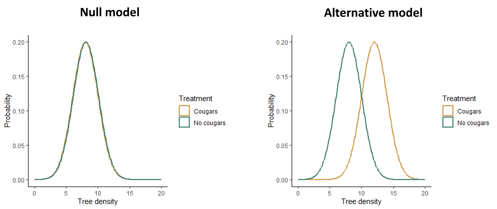

```{r setup, include=FALSE}
knitr::opts_chunk$set(echo = TRUE)
```

# Lesson 7: Introduction to Statistics and Hypothesis Testing

## Why do we use statistics?
Consider the following two scenarios:

1. You are restoring a small forest site, and you choose to use a prescribed burn to reduce the density of invasive trees at your site. To determine if your prescribed burn was effective, you count all of the invasive trees at your site before and after the burn and find that there were fewer invasive trees after the burn.

2. You are testing whether prescribed burns are a generally effective method for controlling a specific species of invasive tree. You set up five controlled burn plots in different locations and count the number of invasive trees in each location before and after the burn.

In the first scenario, you have all of the information you need to definitely answer your question. You wanted to compare the density of invasive trees before and after the burn **at your specific site**. You were able to measure every invasive tree at your site, so when you compared the counts, you could conclude with certainty that there were fewer trees after the burn, no statistical tests necessary.

In the second scenario, however, you are using a small group (your sample group) that you were able to measure to draw conclusions about a much larger group - all invasive populations of the tree species (your statistical population). This is the scenario that requires statistical testing. We cannot guarantee that our sample plots are representative of all populations of the invasive tree that we want to draw conclusions about, so even if we see a pattern in our data we cannot definitely say that we would see the same pattern in the full group. Statistical tests address this problem by giving us a measure of how confident we can be that any patterns in our data are true patterns we would see if we were able to measure the whole population. It allows us to draw a probabilistic conclusion, if not a certain one.

## Statistical hypotheses
When we use statistical tests to draw conclusions about a larger population based on our sample data, our goal is to test specific hypotheses about our data. These statistical hypotheses, or models, are slightly different than biological hypotheses we might develop for our research questions. They do not focus on mechanistic explanations for patterns we observe. Instead, they focus on the patterns, such as relationships between variables, that we might observe in our data themselves.

As statistical practitioners, there are two general types of hypotheses that we develop and test: the null hypothesis and the alternative hypothesis.

The null hypothesis is the hypothesis of no effect. The specific type of effect we refer to depends on our question and the type of test we are using, but generally speaking, in this class, we will be testing for the effect of our independent variable on the mean of our dependent variable. Our null hypothesis would therefore be that our independent variable has no effect on the mean of our dependent variable.

The alternative hypothesis, as you can probably guess, is the opposite. It states that our independent variable does have an effect on the mean of our dependent variable. Sometimes we might state the direction of the effect in the alternative hypothesis. For example, if a medical researcher were testing a new drug for reducing cholesterol, they might only be interested in a positive effect of that drug. In that case, the alternative would be that the drug lowers cholesterol. However, most often in ecology, we don't specify the direction of the effect, to allow for the possibility that the effect could be in either direction. If you have more than one independent variable, you can have more than one alternative hypothesis.

Some examples of null and alternative hypotheses are shown below, along with figures showing what the data might look like if each hypothesis were true. (Note that the figures for the alternative hypothesis show just one example of what the effect might look like - the effect could vary in strength or direction.)

### Example 1

* Question: Does cougar presence affect the density of cottonwood trees?
* Null hypothesis: Cougar density has no effect on the mean density of cottonwood trees.
* Alternative hypothesis: Cougar density affects the mean density of cottonwood trees.



<br>

### Example 2

* Question: Does soil nitrogen affect the diversity of mycorrhizal fungi communities?
* Null hypothesis: Soil nitrogen has no effect on the mean diversity of mycorrhizal fungi communities.
* Alternative hypothesis: Soil nitrogen affects the mean diversity of mycorrhizal fungi communities.


<br>

## What information is important for determining statistical significance?

When we run statistical tests, we are essentially deciding which of our hypotheses, the null or alternative, is best for explaining our data. If our alternative hypothesis comes out as the winner, then we would say that our independent variable has a statistically significant effect on our dependent variable.

The way this is done depends of the type of statistical approach we use (see [Types of statistics] below). However, in one way or another, the different approaches incorporate similar information. Earlier in the semester, you inferred the pieces of information that are important for determining statistical significance, but we will review them here:

1. Signal: The signal is the true pattern or relationship between your variables. This could be the difference in the mean of two groups or the slope of the relationship between two variables, for example. The stronger the signal, the more confident we can be that it is a true pattern that we would observe if we were able to sample the full population.

2. Noise: The noise is the leftover variation in the data. This variation can come from observation error or process error (true variation caused by variables that are not part of the analysis). Either way, this variation can obscure the patterns in the data. The greater the noise, the less confident we can be that the pattern in our data reflects a true pattern in the full population.

3. Sample size: Just like flipping a coin 1000 times is more likely to result in a head to tail ratio that is close to the expected 50:50 ratio than flipping a coin only 10 times, if we have a larger sample size, we can be more confident that any patterns in our data are real and not simply the result of sampling error.

All together, if we have a high signal and sample size, and low noise, it is more likely that patterns in the data will be statistically significant.

## Types of statistics
There are three main statistical approaches that are used to test hypotheses: classical frequentist approaches, information-criterion approaches, and Bayesian approaches. Some people have philosophical reasons for choosing one approach over the other, but in many cases, you will likely draw the same conclusion no matter which approach you use. However, each approach has it's practical advantages that can make it more effective for particular types of questions. 

In this class, we will cover classical frequentist statistics and maximum likelihood statistics. Classical frequentist statistics have been widely used for a long time, they are the most commonly taught statistics in introductory statistics courses (so people will expect you to understand them if you have taken a class like this one), and they are the type of statistics you have most likely been exposed to if you have used statistical tests in the past. Information-criterion approaches have become more widely-used in ecology, and many of you will likely use these types of statistics in the future if you continue in ecology, so I want to expose you to them as well. Although we won't cover Bayesian statistics in this class, I still briefly introduce this approach below because the use of Bayesian statistics is growing rapidly in ecology, so it's good to at least be aware of it because you will likely encounter them in the future.

### Classical frequentist statistics
If you have ever run a statistical test (t-test, ANOVA, regression, Chi-square test) that resulted in a p-value, you have used classical frequentist statistics. We will explore the method in detail when we work through individual types of tests, but I will present the general approach here.

Classical frequentist statistics probably best fit the definition of "hypothesis testing". Specifically, they work by testing the null hypothesis. The logic behind these types of tests works as follows:

1. Assume the null hypothesis is true (i.e., if you were to observe the full population, there would be no relationship between your variables).
2. Imagine that you repeat your experiment over and over again, drawing a sample of the same size from the full population.
3. Calculate the probability that, in these repeated experiments, you would observe a pattern as strong as the one in your data, or stronger, assuming the null hypothesis is true. This probability is known as the p-value.
4. If there is a very low probability of observing a pattern as strong as the pattern in your data if the null hypothesis is true, then we would conclude that the null hypothesis is not a good explanation for our data, so we would reject it. By convention, we typically reject the null hypothesis if p < 0.05, in other words, if there is a less than 5% chance of observing a pattern as strong, or stronger than ours, if the null hypothesis is true. If we reject the null hypothesis, we would then say that there is a statistically significant effect of our independent variable on our dependent variable.

Note that with a p-value of 0.05, there is still a chance that the null hypothesis is true. We would therefore expect that 5% of the time (or 1 in 20 analyses), we would reject the null hypothesis even though it is actually correct. This type of error, concluding there is an effect when in reality there isn't, is known as type I error (false positive). However, there will be many other times when we fail to reject the null hypothesis (if p > 0.05), even when there is a real effect. This is known a type II error (false negative). If we wanted to reduce the type I error rate, we could use a lower threshold p-value. If we want to reduce the type II error rate, it is best to increase the sample size and/or reduce variation to give us more power to detect effects (as per our discussions on experimental design).

Classical frequentist statistics are most useful when you have a specific null hypothesis that you want to test, rather than multiple hypothesis that you are trying to compare. They are also a very well-established and widely-understood approach.

### Information-criterion statistics
Information-criterion statistics have some mathematical similarities to classical frequentist statistics, but rather than focusing on testing a single hypothesis (the null hypothesis), information criterion statistics work by comparing multiple hypotheses to each other. On the simple end, this could be comparing the null hypothesis to a single alternative hypothesis, but if you have multiple hypothesis, you can compare those hypotheses to each other as well. Because of this, information-criterion statistics are often better suited for questions involving multiple independent variables or different model structures. This is one reason they have become popular in ecology. We are often working in messy, uncontrolled systems in which many variable effect our outcome of interest, and we want to know which variables are most important for explaining the patterns we see in that outcome.

The logic behind information-criterion statistics is, in my opinion, less convoluted than the logic behind p-values. Information-criterion statistics work by testing each of your hypotheses one at a time and calculating the probability of observing your specific data set, assuming that hypothesis is true. This probability is known as the likelihood value. The higher the likelihood value, the better the hypothesis is for explaining your data. These statistics also penalize for the complexity of the model (because a more complex model will always result in at least a slightly higher probability), so ultimately the model deemed as best is the simplest model that has the highest probability of leading to your data.

Because this type of statistics considers all of your hypotheses, not just the null hypothesis, it can be used to rank your hypotheses from best to worst. However, you can also use a threshold (similar to the p < 0.05 threshold) to select one model as the best. Usually if there is a difference in information criterion value of two or more between two models, the model with the **lower** value is selected as the best (lower information criterion means higher likelihood and lower complexity of the model). If your alternative model comes out on top, you could then conclude that your independent variable has a significant effect on your dependent variable.

### Bayesian statistics
An oddity of both classical frequentist and information criterion statistics is that, even though we are trying to draw conclusions about our hypothesis, the probabilities we calculate are actually probabilities about the data. Given a particular hypothesis, what is the probability of observing data like ours? This can make the interpretation somewhat unintuitive because if we are trying to assess a hypothesis, intuitively we should be calculating the probability that the hypothesis is correct.

That is exactly what Bayesian statistics does for us.  Bayesian approaches use a likelihood calculation, just like information-criterion approaches, but then apply a mathematical trick, known as Bayes Theorem (which we will cover in one of our upcoming probability lessons), to estimate the probability that a particular hypothesis is true. This makes the interpretation of Bayesian statistics more intuitive. However, it makes the implementation a lot more computationally intense. In fact, although the theory behind Bayesian statistics is old, they have only become practical to implement with modern computers.

In addition to being more intuitive to interpret, Bayesian statistics have a number of other benefits that are useful in the context of ecology. One of the biggest strengths of Bayesian statistics is it's ability to handle variation, including separating out different sources of variation, such as observation error and process variation. It is also useful in forecasting (making predictions about the future) due to the ease of incorporating both past information and new data.

Despite their differences, all three approaches are rooted in probability. In the rest of this module, we will dig into some basics of probability that underlie these tests.
