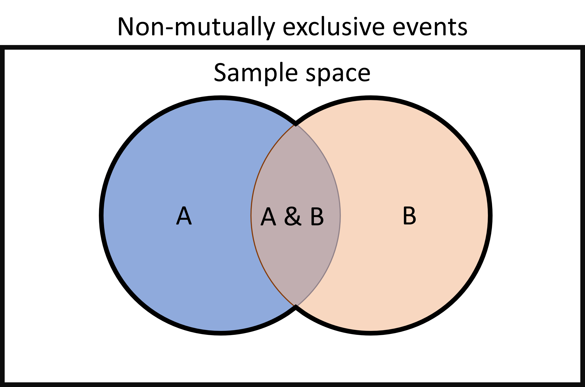

```{r setup, include=FALSE}
knitr::opts_chunk$set(echo = TRUE, message=FALSE, warning=FALSE)
```

# Lesson 8: Probability 

## Lession 8.1 Probility Basics

Probability is a field of mathematics that is used for the study of random events. It allows us to quantify the likelihood of particular outcomes. In scientific research, when we sample from a population, the act of sampling is a random event. When we analyze data, we use probability to help us draw conclusions based on the particular outcome we observe in our data.

### Basic laws of probability

The probability of an event is defined as the likelihood that particular event occurs. In order to calculate the probability, we have to define the event and the sample space: 

+ **Event**: A specific outcome or set of outcomes

+ **Sample space**: The full set of possible outcomes

We can then calculate the probability by dividing the number of favorable outcomes (the number of outcomes that match the criteria defined by our event) by the total number of possible outcomes.

$$
P(\text{Event}) = \frac{\text{Number of favorable outcomes}}{\text{Total number of possible outcomes}}
$$
In this equation, $P(\text{Event})$ is shorthand for the probability of the event.

If we know the probability of an event and the total number of possible outcomes, we can also flip this equation around to calculate the number of favorable outcomes:

$$
\text{Number of favorable outcomes} = \text{Total number of possible outcomes} \times P(\text{Event})
$$
The formula for calculating probability leads to some useful rules that can help us understand and calculate probabilities:

1. The values of probabilities are between 0 and 1.
2. The probability of an impossible event is 0. 
3. The probability of a certain event is 1.
4. The sum of the probabilities for all possible events is 1 
5. The probability that an event does not happen is 1 minus the probability that the event does happen. (This follows from rule 4 because an event happening and an event not happening represent all possible outcome, so the probabilities of the two must add to one.)

Now let's look at some examples of how we can use these equations for calculating probabilities:

#### Example 1
A plant community has 50 individuals of species 1, 40 individuals of species 2, 20 individuals of species 3, and 10 individuals of species 4. If we randomly select an individual from the population, what is the probability that individual is species 3?

Let's start by identifying our event and sample space:

Event: Selecting an individual of species 3. There are 20 favorable outcomes because there are 20 individuals of species 3.
Sample space: The total number of individuals in the community

Then we'll calculate our probability:

$$
P(\text{Species 3}) = \frac{30}{50 + 40 + 20 + 10} = \frac{30}{120} = 0.25
$$

#### Example 2
*Staphylococcus aureus* is a bacteria species that can cause disease in humans, and it is known for high levels of antibiotic resistance. It is estimated that the rate of Penicillin G resistance in *Staphylococcus aureus* is 80%, or $\frac{4}{5}$. If there are 120,000 patients with bloodstream infections from *Staphylococcus aureus*, how many of those patients would be expected to have strain that is resistant to Penicillin G?

For this one, we are given the probability of Penicillin G resistance ($\frac{4}{5}$) and the total number of outcomes (120,000), so we can work backwards to calculate the number of "favorable events" (i.e., number of patients with a resistant strain).

$$
\text{Number resistant} = 120000 \times \frac{4}{5} = 96000
$$

#### Example 3
Wetland-associated frog species in the United States have a $\frac{2}{5}$ chance of being infected with chytrid fungus. What is the probability that a wetland-associated frog is not infected with chytrid?

To answer this, we can use the law of probability that states that the probability that an event does not happen is 1 minus the probability that the event does happen:

$$
P(\text{Uninfected}) = 1 - P(\text{Infected}) = 1 - \frac{2}{5} = \frac{3}{5}
$$

### Probabilties of multiple events
In the section above, we calculated the probability of single events. However, often we want to know the probability of multiple events. In this section we will cover rules for combining together the probabilities of multiple events. There are two general types of questions that involve combining together probabilities for multiple events:

1. What is the probability that two or more events both/all happen? (What is the probability of event A and B both happening?)
2. What is the probability of one event or another event(s) happening? (What is the probability that event A or event B happens?)

To combine together probabilities in this way, we use the multiplication and addition rules, respectively. To help me remember which is which, I try to remember the relationship between the key words in the question and the rule I need to use:

+ **BOTH**/**AND** = Multiplication rule
+ **EITHER**/**OR** = Addition rule

For this section, we will assume that the events we are considering are independent. In other words, the outcome of one event does not influence the probability of the outcome of the other event(s).

#### Multiplication rule
If we want to know the probability that two events, lets call them events A and B, both happen (i.e., event A **AND** event B happen), we use the multiplication rule. We simply multiply together the probabilities of event A and event B to get the probability that event A and B both happen:

$$
P(\text{A and B}) = P(\text{A}) \times P(\text{B})
$$
For example, if we roll two dice, and we want to know the probability of rolling a 6 on both dice, we would calculate that as follows:

$$
P(6 \text{ and } 6) = \frac{1}{6} \times \frac{1}{6} = \frac{1}{36}
$$

#### Addition rule
If we want to know the probability that one event **OR** another event happens, we use the addition rule. We add together the probabilities of the individual events to get the probability that either one of the events happens.

$$
P(\text{A or B}) = P(\text{A}) + P(\text{B})
$$
For example, if we roll a die and want to know the probability of rolling an even number (2, 4, or 6), we would calculate that by adding together the probabilities of each one of those possible outcomes:

$$
P(2, 4, \text{ or } 6) = \frac{1}{6} + \frac{1}{6} + \frac{1}{6} = \frac{3}{6} = \frac{1}{2}
$$
This version of the addition rule only works for events that are mutually exclusive, meaning that if one event happens, the other(s) cannot. This is true in the example we used of rolling the die. If we roll a single die once, and get a 2, that means we can't also get a 4 or 6. If two events are not mutually exclusive (they can both happen at the same time), then we have to use an alternative version of the addition rule to account for that.

#### Addition rule for non-mutually exclusive events
When we have non-mutually-exclusive events, which can both happen at the same time, if we use the addition rule above to estimate the probability that either of the events happens, we will over-estimate the probability. This is because the addition rule will essentially double-count the probability of both events happening. This is easier to understand if we look at a visual representation of the probability of the events.

In the diagram below, the outer rectangle represents the sample space, or the full set of possible outcomes. The area of the blue circle represents the probability that event A happens, and the area orange circle represents the probability that event B happens. The area of overlap between the two is the probability that both events happen.

{width=60%}
<br>

To calculate the probability that either event A or event B happens, we want to calculate the area that is surrounded by the black outline around the two circles. If we do that by adding together the total area of both circles, the area of overlap in the middle will be counted twice, but to accurately calculate the area, we only want to count it once.

We can account for this by adapting our addition formula to subtract out that area of overlap. In other words, we have to subtract out the probability of A and B both happening. This takes us back to the multiplication rule. To calculate the probability of both A and B happening, we multiply the two probabilities together, so that is the value we need to subtract from the addition rule:

$$
P(\text{A or B}) = P(\text{A}) + P(\text{B}) - P(\text{A})P(\text{B})
$$
Here's an example of how this works. Say we are interested in the prevalence of parasites in a population of elk. There are two common parasites in the population: tapeworm cysts (*Taenia krabbei*) and brainworm nematodes (*Parelaphostrongylus tenuis*). You know the frequency of tapeworms is 0.3 and the frequency of brainworm 2 is 0.4, and it is possible for a single individual to be infected with both parasites at the same time (i.e., infection by the two parasites is not mutually-exclusive). You want to know the probability that an individual in the population is infected with at least one of the parasites. We can do that using the modified addition equation for non-mutually exclusive events, as shown below (T = tapeworm, B = brainworm):

$$
P(\text{T or B}) = P(\text{T}) + P(\text{B}) - P(\text{T})P(\text{B})
$$
$$
P(\text{T or B}) = 0.3 + 0.4 - (0.3\times0.4) = 0.58
$$
Therefore, the probability of an individual being infected with at least one of the parasites is 0.58. Had we used the addition rule for mutually-exclusive events, we would have incorrectly estimated the probability to be 0.7.

### Exercises: Applications in ecology and evolution

<!---LEARNR EX 1-7-->
   
<iframe style="margin:0 auto; min-width: 100%;" id="myIframeL3" class="interactive" src="https://rby8g8-emily-schultz.shinyapps.io/RHandbookL8/
" scrolling="no" frameborder="no"></iframe>
   
<!---------------->

## Lession 8.2 Advanced Probability

### Conditional probability
In the probability examples we considered above, when we calculated the probability of multiple events, we assumed those events were independent - the outcome of one event did not influence the probability of the other outcome(s). However, often this is not true. In many cases, a particular event or condition does affect the probability of another event. We refer to this as conditional probability: the probability of one event is conditioned on another.

We actually worked with conditional probability when we discussed hypothesis testing. When we looked at the probabilities of observing a particular outcome in our data, we calculated those probabilities based on a particular hypothesis, or condition.

In this section, we will learn how to calculate conditional probabilities.

We'll start with an example (you might remember this from the probability questions we went through on the first day of class):

Approximately 1% of women aged 40-50 have breast cancer. A woman with breast cancer has a 90% chance of a positive test from a mammogram, while a woman without has a 10% chance of a false positive result. What is the probability a woman in the 40-50 age range has breast cancer given that she just had a positive test? 

This is a conditional probability question because we want to know the probability that a woman has breast cancer, based on a particular set of conditions: she is in the 40-50 age range and she just had a positive test result.

We'll go through three methods for solving this. All of them with lead to the same answer, so when you solve problems like this you can work with the method that makes the most sense to you.

#### Option 1: Diagram
Let's start out with a visual that shows the possible scenarios and their probabilities:

{width=60%}
<br>

This diagram summarizes the information in the question regarding the percent of women with and without cancer and their respective percent chances of getting a positive and negative mammogram result. We could solve the problem with just these percentages, but is easier to work with number of individuals than percentages.

Let's assume we start with a group of 1000 women (we could choose any number of women, but 1000 is a nice round number that will allow us to work with whole numbers instead of fractions.) If we have 1000 women in this group, and 1% are expected to have cancer, we would expect 990 of those women not to have cancer and 10 of those women to not have cancer. Each of those groups now have a different probability of a positive test result. Women without cancer have a 10% chance of a false positive, so we would expect 99 of the cancer-free women to get a positive result, while 891 would get a negative result. Women with cancer have a 90% chance of a true positive, so we would expect 9 of the 10 to get a positive result and 1 to get a negative result. These numbers are summarized in the diagram below.

{width=60%}

<br>

Now that we have the number of women in each group who would get positive and negative test results, it is easier to calculate the probability that a woman has cancer if she got a positive result. We just have to identify the number of women who got a positive test result and actually have cancer (9) and the total number of women who got a positive result (9 women who have cancer and got a positive result + 99 women who do not have cancer and have a positive test result = 108 total positive tests). Now we can calculate our probability:

$$
P(\text{Cancer|Positive}) = \frac{9}{108} = 0.083,
$$
where $P(\text{Cancer|Positive})$ is the probability of cancer given a positive test result.

#### Option 2: Table

For our second strategy, we will put together a table representing all of the probabilities for our scenario: cancer or no cancer and positive test or negative test. We will fill in the table with the probabilities for each of those combinations (using the multiplication rule!). For example, in the upper left hand corner in the table below, we calculate the probability of a woman having cancer and getting a positive test result, so we multiply together the probability of having cancer and the probability of a positive test results if a woman does have cancer.

<style type="text/css">
.table {
  width: 80%;
}
</style>

|          | Cancer (1%) | No cancer (99%) |
| :---     |    :---: |     ---: |
| Positive | True positive: 0.01 x 0.9 = 0.009 | False positive: 0.99 x 0.1 = 0.099 |
| Negative | False negative: 0.01 x 0.1 = 0.001| True negative: 0.99 x 0.9 = 0.891 |

Once we have calculated the probability for each combination, we can use the probability values to calculate the probability we want: the probability of having cancer given a positive test result. We can do this by dividing the probability of a true positive result (probability of having cancer and getting a positive result = 0.009) by the total probability of getting a positive result (0.009 probability of a true positive plus 0.099 probability of a false positive):

$$
P(\text{Cancer|Positive}) = \frac{0.009}{0.009+0.099} = 0.083,
$$
This method gives us the same probability that we got using the method above.

#### Option 3: Bayes Theorem

The final method is the most formal method. It uses a formula known as Bayes Theorem for calculating conditional probability. The theorem is as follows:

$$
P(A|B) = \frac{P(B|A) \times P(A)}{P(B)}
$$
In this formula, $P(A|B)$ is the probability that event A occurs given that event B has occurred, $P(B|A)$ is the probability that event B occurs given that event A has occurred, and $P(A)$ and $P(B)$ are the total probabilities that events A and B occur, respectively.

Putting these terms in the context of our question, $P(A|B)$ is the probability of having cancer given a positive test result, $P(B|A)$ is the probability of a positive test result given a woman has cancer, $P(A)$ is probability of having cancer, and $P(B)$ is the total probability of a positive test result. 

Filling in the values for $P(B|A)$ and $P(A)$ is easy because we are given that information in the question. If a woman has cancer, there is a 90% chance (0.9 probability) of getting a positive test result, so that is the value of $P(B|A)$. The chance that a woman in this age group has cancer is 1% (0.01 probability), so that is the values of $P(A)$.

Calculating the value of $P(B)$ is more involved because we have to account for two ways of getting positive test result: having cancer and getting a positive result or not having cancer and getting a positive result. We can use the multiplication rule to get both of those values and then add the results together. The probability of having cancer and getting a positive result is the probability of having cancer multiplied by the probability of getting a positive result if you have cancer:

$$
P(\text{Cancer and Positive} = 0.01 \times 0.9) = 0.009
$$
The probability of not having cancer and getting a positive result is the probability of not having cancer multiplied by the probability of getting a positive result if you do not have cancer:

$$
P(\text{No cancer and Positive} = 0.99 \times 0.1) = 0.099
$$
If we add those two values together, we get 0.108.

We can now fill all of our values into Bayes Theorem:

$$
P(Cancer|Positive) = \frac{0.9 \times 0.01}{0.108} = 0.083
$$
Once again, we get the same probability, showing that all of these methods get us to the same result. You are welcome to choose whichever strategy that you prefer for solving problems like this. Personally, I often use two of the methods to double-check my work.

#### Applications of conditional probability in statistics
Aside from its uses in calculating probability questions like the example above, conditional probability plays an important role in the approaches we use for hypothesis testing. As I mentioned at the start, when we looked at the probabilities in our hypothesis testing examples, those were conditional probabilities. They were the probabilities of observing a particular outcome in our data, given a particular hypothesis. In classical frequentist statistics, we calculate the probability of our observed outcome or a more extreme outcome, given the null hypothesis being true. If that probability is low, we reject the null hypothesis. In information criterion approaches, we calculate the likelihood values for every hypothesis we are considering, which the the probability of observed the exact outcome in our data, assuming a particular hypothesis is true. In both of these approaches, in one way or another, we are calculating the probability of our data given a hypothesis: $P(Data|Hypothesis)$.

In Bayesian statistics, the third approach for drawing conclusions about our hypothesis, we calculate the probability the other way around, the probability of a hypothesis given our data: $P(Hypothesis|Data)$. This is more intuitive in terms of the conclusions we want to draw, but more computationally challenging. The premise behind the computation, though, is the conditional probability formula, Bayes Theorem, that is described above. It uses the same likelihood values used in information criterion approaches ($P(Data|Hypothesis)$), the probability of a hypothesis, and the probability of the data to calculate the probability of the hypothesis given a particular data set.

### Binomial Theorem

When we discussed hypothesis testing, we worked with some probability tables that showed the probability of a particular number of outcomes in our data (number of ducks that chose green bread or number of offspring that had the dominant trait). These probabilities were calculated with a formula known at the binomial theorem.

The binomial theorem works when you are working with an experiment that has two possible outcomes. A classic example in probability is flipping a coin. There are two possible outcomes you can get when you flip a coin: heads or tails. However, in ecology we work with a lot of data like this, including but not limited to:

+ Survival: individuals can survive or die
+ Reproduction: individuals can reproduce or not
+ Species occurrence: a species can be present or absence

When we are working with data like these, we can label one outcome as a success (e.g., surviving) and one outcome as a failure (e.g., dying). The binomial theorem then allows us to calculate the probability of a specific number of successes in a given number of trials, based on the probability of success. For example we could calculate that 70 out of 100 individuals in a population survive. The number of successes in this example would be 70 and the number of trails would be the total number of individuals in the population: 100.

We'll walk through the process of calculating this probability for a specific example, and then I will present the full formula for the binomial theorem. Here is the question we will work with for our example: The probability of survival for a species is 0.6. If we have 3 individuals of that species, what is the probability that exactly 2 will survive. In this example, we have 3 trials (the total number of individuals), we want to know the probability of exactly 2 successes (survival), and the probability of success is 0.6.

To start, let's calculate the probability that the first two individuals survive and the third individual dies. We can do this using the multiplication rule because we want to know the probability that individual 1 survives AND individual 2 survives AND individuals 3 dies. We can calculate that by multiplying together those three probabilities, remember that the probability of survival is 0.6, so the probability of dying is 0.4:

$$
P(\text{2 survive, 1 dies}) = 0.6 \times 0.6 \times 0.4 = 0.144
$$
This gives us a probability of 0.144 for one way that we could get 2 survivors out of our three individuals. This is not our final answer, though, because there are other ways that exactly 2 of the three individuals survive: individuals two and three could survive while individual one dies, or individuals 1 and 3 could survive while individual two dies. In total, there are three possible ways that two individuals survive and the other dies, so what we ultimately want to calculate is the probability that we get any one of these three outcomes. We can use the addition rule to get that probability:

$$
P(\text{2 survive, 1 dies}) = 0.144 + 0.144 + 0.144 = 3 \times 0.144 = 0.432
$$
Therefore our total probability that exactly 2 of the three individuals survive is 0.432.

This also leads us to an overall framework for approaching problems like these. To calculate the probability of a specific number of successes, we start by multiplying the probability of that number of successes by the probability that the remaining trials are failures. Then we multiply that probability by the number of combinations that will give us the correct number of successes and failures. We have general formulas we can use for each of these terms.

#### Probability of $x$ number of successes:
If we want to know the probability of $x$ number of successes (assuming the probability of success is the same for all trials), we calculate that as follows:

$$
P(\text {x successes}) = p^x ,
$$
where $p$ is the probability of success. In our example, $p$ was 0.6 and $x$ was two, so the probability of two successes was

$$
0.6^2 = 0.6 \times 0.6 = 0.36
$$

#### Probability of failures:
If we want to know the probability of exactly $x$ successes in a certain number of trials (we'll call the number of trials $n$), that assumes the remaining trials must result in failures, so we want the know the probability of $n-x$ failures. We calculate that as:

$$
P(n-x \text { failures}) = q^{n-x} ,
$$
where $q$ is the probability of failure In our example, $q$ was 0.4 and $n-x$ was one, so the probability of two successes was

$$
0.4^1 = 0.4
$$

#### Number of combinations:
When we worked through the number of combinations that would give us 2 survivors in 3 individuals, we just manually listed the number of combinations. That is doable when we only have a few trials, but it quickly become unwieldy as we increase the number of trials. Luckily there is a formula we can use as a shortcut for calculating the number of ways to get $x$ successes in $n$ trials:

$$
\frac{n!}{x!(n-x)!}
$$
If you fill in the values of $n$ and $x$ in the formula, you will get the correct number of combinations. If you are unfamiliar with the ! symbol, that is the factorial symbol. You calculate $n!$ as follows:

$$
𝑛!=𝑛\times(𝑛−1) \times (𝑛−2) \times ⋯ \times 1 
$$
Scientific calculators (and R!) have built-in functions for calculating factorials.

For the purposes of this class, I won't go into the math behind this shortcut, but if you would like to learn more, Khan Academy has a series on calculating combinations: <a href="https://www.khanacademy.org/math/precalculus/x9e81a4f98389efdf:prob-comb/x9e81a4f98389efdf:combinations/v/introduction-to-combinations" target="_blank" rel="noopener noreferrer">Khan Academy Combinations series</a>

#### Putting it all together

We now have all of the pieces we need for our full binomial formula:

$$
P(x,n) = \frac{n!}{x!(n-x)!}p^{x}q^{n-x},
$$
where $P(x,n)$ is the probability of x successes in n trials. The first term calculates the number of combinations, the second calculates the probability of the correct number of successes, and the last calculates the probability of the correct number of failures.

If we fill in the formula for our example of 2 survivors in 3 individuals, with a survival probability of 0.6, it would look like this:

$$
P(2,3) = \frac{3!}{2!(3-2)!}0.6^{2}0.4^{3-x2} = 0.432
$$
The trick to using this formula is correctly identifying the values of $n$, $x$, $p$, and $q$. Once we identify those values, it is easy to fill them into the formula. Programs like R even have built-in functions for calculating the binomial theorem, which we will work with in class.

One of the most important applications of the binomial theorem in ecology and statistics is exactly the way we used it in our hypothesis testing examples. We can calculate the probability of a certain number of successes in our data, based on a particular hypothesis, and use those probabilities to draw conclusions about how well our hypotheses match the patterns in our data.

<script>
  iFrameResize({}, ".interactive");
</script>