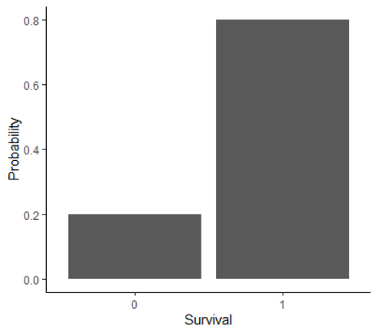
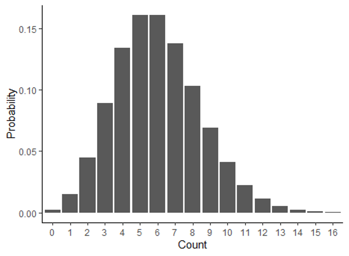
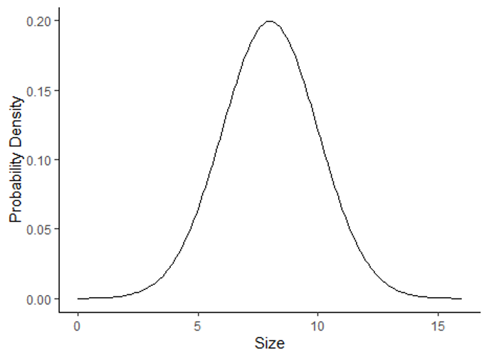
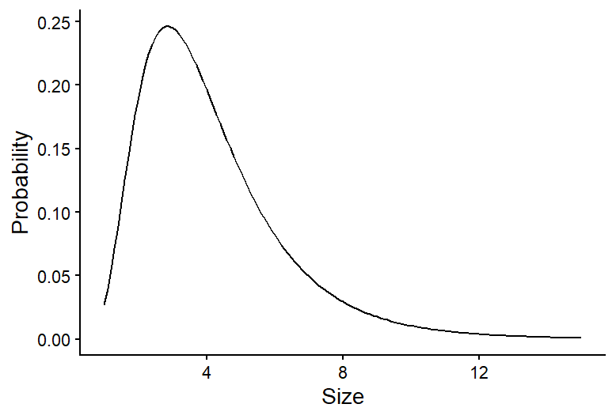

```{r setup, include=FALSE}
knitr::opts_chunk$set(echo = TRUE, message=FALSE, warning=FALSE)
```

# Lesson 9: DISTRIBUTIONS AND DESCRIPTIVE STATISTICS

In this lesson, we will cover some of the basics of probability distributions and how they are used in statistics. Then we will practice graphing distributions in R and calculating descriptive statistics.

## 9.1 The use of probability distributions in statistics
Although we didn't use the term "probability distributions", we have already had a taste of working with distributions in our lessons on hypothesis testing and probability.

Think back to the examples we worked through when we covered hypothesis testings. In those examples, we looked at the probability of observing specific outcomes (a specific number of ducks choosing green bread, or a specific number of offspring with a particular trait) based on a particular hypothesis. We then used those probabilities to draw conclusions about the hypotheses. The tables of probabilities that we worked with in those examples were probability distributions. Probability distributions are simply functions or tables that show the likelihood, or probability, of all possible outcomes in an experiment. In the duck experiment, for example, there were 11 possible outcomes: anywhere from 0 to 10 ducks could have chosen the green bread. The table of probabilities showed the probability of each of those outcomes, assuming the null hypothesis is true.

In the type of statistics that we will work with in this class, the strategies that we used in our hypothesis testing lesson are exactly the strategies we will use when we work with probability distributions in statistical tests. The statistical test will use a probability distribution to calculate the probability of observing an outcome in our data, based on either the null hypothesis or an alternative hypothesis, and then we draw conclusions based on the probability that comes out of the test.

## 9.2 Types of distributions
There are many different types of probability distributions that we can use in statistical testing, and to draw accurate conclusions about our data, it is important to use a distribution that is a good fit for the properties of our data, similar to choosing the right type of graph for visualizing our data, based on the type of data we are working with.

In our duck and genetics examples, we were working with what is known as a binomial distribution. You also worked with this type of distribution using the snow forecast data. In fact, in the forecast example, you calculated the values for part of the binomial distribution yourself using the binomial theorem. The binomial distribution works well when your experiment has two possible outcomes (known as a Bernoulli trial) and you want to know the probability of a specific number of successes in a fixed number of trials. This fit the data we were working with in our duck, genetics, and forecasting example. It also works well when we are measuring variables like survival, reproduction, and presence/absence, which are common types of variables used in ecology. 

However, there are many other types of data that we work with as well, such a numeric data, including both count data and continuous variables like temperature, growth, and nutrient concentration. These variables have far more than two possible outcomes, so we have to use different types of distributions to represent those data and the probabilities of the outcomes. The tables below summarize some common distributions and their uses. They are divided into discrete distributions, which include distributions for both categorical and discrete variable, and continuous distributions for continuous data. Of these distributions, the one we will work with the most in this class is the normal distribution. Many of the test we will run, such a t-tests, ANOVAs and linear regressions are designed for data with a continuous independent variable and operate under the asssumption that the data are normally distributed.

### Discrete distributions

| Distribution | Use | Example |  Graph |
| :-- |    :---: |   :---: | :------: |
| Bernoulli | Probability for a single Bernoulli trial with two possible outcomes |Modeling the probability of survival and reproduction at the individual level | |
| Binomial | Probability of number of successes in a specific number of Bernoulli trials |Modeling the probability of survival and reproduction at the population level | |
| Poisson | Probability of observing a specific count in a given amount of space or time |Modeling the probability of the number of pollinator visits | |

### Continuous distributions
| Distribution | Use | Example |  Graph |
| :-- |    :---: |   :---: | :------: |
| Normal | Probability of outcomes for continuous data with a bell-shaped distribution |Modeling the probability of the mean annual temperature | |
| Log-normal | Probability of outcomes for continuous data with a skewed distribution |Modeling the probability of habitat patch sizes | |


## 9.3 Graphing data distributions
Now that we have an overview of probability distributions, we will practice graphing distributions and calculating descriptive statistics in R. We will focus on continuous distributions, particularly normal distributions, because we will work with these distributions the most in this class.

Because we use formal probability distributions, like the ones described above, to represent the distribution of data we collect, we will start by using a historgram to show the distribution of observed data, and then we will overlay those data with a formal probability distribution to see how they compare. 

We will work with the **BKSnow.csv** file, which has monthly snowfall data for Breckenridge, dating back to the late 1940s. Download the data file and upload that file into R now (be sure to set your working directory first, and save your code in a script file):

```{r load_data}
snow <- read.csv("BKSnow.csv")
```

Load the **ggplot2** package for this session:

```{r load_ggplot}
library(ggplot2)
```

We will start by making a histogram of our "JULJAN" variable, which is the total snowfall from July to January.

```{r histogram}
ggplot(data = snow, aes(x = JULJAN)) +
  geom_histogram() +
  labs(x = "Snowfall from July to January", y = "Frequency")+
  theme_classic()
```

## 9.4 Descriptive statistics
Descriptive statistics are statistics that summarize the quantitative features of a data set, like the central tendency (where are most of the data centered) and the variation of the data. They are not the statistics that we get from statistical tests that are used to draw inferences about out data, but they can be used to help describe the distributions of our data. We will cover a few measures of central tendency and variation that are commonly used.

### Central tendency
There are three main measures of central tendency that are commomly used: mean, median, and mode. Here are the definitions of each, along with information about when each measure is best used.

#### Mean
The mean is calculated by summed up the data points and dividing by the number of data points. It provides a measure of where the center of the total value of your data points lie. Because the mean is sensitive to outliers in a data set, it is best used when you have a symmetrical distribution of your data, like a normal distribution. In fact, it is one of the parameters that is used to formally define a normal distribution.

#### Median
The median is the value of the center data point in your data set. It is calculated by putting the data points in order from lowest to highest and taking the middle value. If there are an even number of data points, the two central values are averaged to get the median. The median is less sensitive to outlier values, so it is often the preferred measure of central tendency for skewed data, like data with a log-normal distribution.

#### Mode

The mode is the most frequent value in a data set. It is often a good measure to use when you have data with a bi-modal distribution (two values that are most frequent) because two peaks in a distribution are not captured well by the mean and median. When you have continuous data, there usually isn't a single value that is repeating frequently in the data (because there are an infinite number of possible outcomes), but you can still think of the mode as the most frequently observed range of values. The mode is the measure of central tendency we will use the least in this class, and it is often enough to infer it visually from a frequency histogram in this class, so we won't practice calculating it in R here, but you can always look up the function if you need it!

### Variation

Measures of variation measure the amount of spread in a data set. Two commonl measure of variation are the variance and standard deviation.

The variance ($\sigma^2$) is calculated by calculating the difference between each data point and the mean, squaring those values, and then adding them up and dividing by the number of data points:

$$
\sigma^2 = \frac{\sum(x_i - \mu)}{N},
$$
where $x_i$ is the value of each individual data point, $\mu$ is the mean of the data set, and $N$ is the number of data points.

In other words, the variance is the mean squared deviation of the data points from the mean. The standard deviation is simply the square root of the mean.

An advantage of the standard deviation over the variance is that the standard deviation is in the same units as the original data points, whereas the variance  is in the square of the original units. The standard deviation is used as the formal measure of variation for defining distributions like the normal distribution. However, the mathematical properties of variance can make it useful in some types of calculations, and it it often used in more advanced statistical tests that focus on the variation itself in data.

### Descriptive statistics in R

Below, we will cover how to calculate the mean, median, standard devitaion, and variance of the "JULJAN" variable in the data frame.

#### Central tendency

You have used the `mean` function before, but this time we will calculate the mean of a column in  data frame instead of the mean of a vector. Notice the use of the optional `na.rm=T` argument to remove missing values before calculating the mean.

```{r mean}
mean_JULJAN <- mean(snow$JULJAN,na.rm=T)
mean_JULJAN
```

Calculating the median is similarly intuitive:

```{r median}
median_JULJAN <- median(snow$JULJAN,na.rm=T)
```

Next, we will add lines representing the mean and median to the histogram we made above. This will allow us to visualize where these values fall relative to the distribution of our data. We can do this by adding two lines to the codes we already wrote to create our histogram:

```{r center_visual}
ggplot(data = snow, aes(x = JULJAN)) +
  geom_histogram() +
  geom_vline(aes(xintercept=mean_JULJAN),color="blue",linewidth=1) +
  geom_vline(aes(xintercept=median_JULJAN),color="orange",linewidth=1) +
  labs(x = "Snowfall from July to January", y = "Frequency") +
  theme_classic()
```

The two lines we added are the lines using the `geom_vline` function, which adds a vertical line to the graph. The first argument for this function is the aes argument, like we saw in the `ggplot` function. To add a vertical line, we need to give R the x-intercept of that line. In this case, we want to add lines representing the mean and median, so the intercepts of the lines will be the mean and median of the "JULJAN" variable that we calculated above. After the aes argument, I also add to optional arguments: color and linewidth. The color argument allows you to change the line color. You can use either the name of the color or the hex code. The linewidth function allows you to change the thickness of the line. Here, by setting the linewidth to 1, we are making the lines thicker than the default, so they are easier to see. 

Based on the mean and median, would you say the data are close to normally distributed or skewed (i.e., log normal)?

#### Variation

In this section, you will practice calculating measures of variability in a data set: standard deviation and variance.

We'll continue working with the "JULJAN" and "LOG_JULJAN" variables in our data frame.

Calculate the standard deviation and variance as follows:

```{r variability}
sd_JULJAN <- sd(snow$JULJAN,na.rm=T)
sd_JULJAN
var_JULJAN <- var(snow$JULJAN,na.rm=T)
var_JULJAN
```

Notice the relationship between the two. The standard deviation is the square root of the variance, so we could also calculate one from the other.

## 9.3 Adding probability distributions
So far, we have been graphing the frequency distributions of our data, but we have been discussing using formal statistical distributions to represent our data. Now we will practice calculating a formal distribution (the normal distribution) and comparing it to our data.

R has a function, `dnorm`, that can be used to calculate the probability density of a value for a particular outcome. We can use this function to graph the probability density function for snowfall in Breckenridge by using the function to calculate the probability density for a wide range a values and graphing the output.

Based on the histogram we made, a good range of values to use for the possible outcomes in for our is 1 to 200 because that covers the full range of snowfall values that we observed. When we use the `dnorm` function, we will provide this range as the first argument. We can create this sequence of numbers using the `:` symbol. Then, to calculate the probability density of all of these snowfall values, we have to provide the mean and standard deviation of our distribution as the next two arguments. We will use the mean and standard deviation we calculated for our JULJAN variable above. We will save the probability densities values that we calculate in a vector called "pdens".

```{r normal}
pdens <- dnorm(1:200,mean=mean_JULJAN,sd=sd_JULJAN)
```

In order to graph our data using ggplot, we have to put the data in a data frame. We will create a data frame with two variables: one with the range of snowfall values and the second with the probability densities of those snowfall values.

```{r normal_data}
pdens_data <- data.frame(snow=1:200,pdens=pdens)
```

Finally, we can graph this distribution on top of our histogram, so we can compare the distribution of our data with the probability distribution.

We will do this by adding another layer to our graph, with the `geom_density` function. In this function, we are using a different data set that the one we used for the rest of our graph ("pdens_data" instead of "snow). Because of this, inside this function, we have to tell R the new data set we want to use (first argument) and the values we want to graph (x and y inside the aes argument). In this case we want to graph the probability density for each snowfall value. Then we include another argument (stat = "identity"), which tells R that we want to graph the probability density based on the value we provide in our data frame, rather that calculating the density based on the frequency of values in the data frame. Finally, the last argument again changes the thickness of the line.

Notice I have also modified the `geom_histogram` function. I added an argument (`aes(y=..density..)`). This change rescales to values in the histogram so they represent a probability density, rather than a frequency. This will put the values on the same scale as the probability density function we calculated, so we can effectively compare the distribution of our data to the probability distribution.

Here's the full code for the graph:

```{r normal_graph}
ggplot(snow,aes(x=JULJAN)) +
  geom_histogram(aes(y=..density..))+
  geom_vline(aes(xintercept=mean_JULJAN),color="blue",linewidth=1) +
  geom_vline(aes(xintercept=median_JULJAN),color="orange",linewidth=1) +
  geom_density(data=pdens_data,aes(x=snow,y=pdens),stat="identity",linewidth=1)+
  theme_classic()
```

Based on this graph, we can see a fairly close match between the distribution of our data and a normal distribution with the same mean and standard deviation as our data. As we procede with formal statistical tests in the upcoming portion of the class, we will learn more details about how we use different types of distributions to draw conclusions about our data.

## Exercises

<!---LEARNR EXERCISES-->
   
<iframe style="margin:0 auto; min-width: 100%;" id="myIframeL3" class="interactive" src="https://rby8g8-emily-schultz.shinyapps.io/RHandbookL9/
" scrolling="no" frameborder="no"></iframe>
   
<!---------------->

<script>
  iFrameResize({}, ".interactive");
</script>